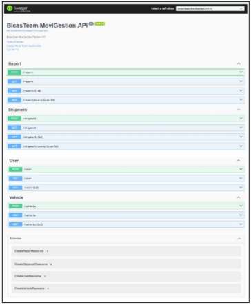
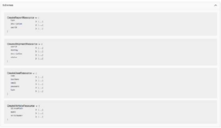

# Capítulo V: Product Implementation

## 5.1. Software Configuration Management.

Para administrar la configuración de software de nuestra app, nos centraremos en tres aspectos principales: el control del código fuente, que implica gestionar las versiones y establecer una estructura organizada para el código; la configuración del entorno de desarrollo, donde nos aseguramos de que todos los miembros del equipo cuenten con herramientas consistentes; y la configuración de implementación, que se ocupa del despliegue en entornos de producción. Estas decisiones garantizan la coherencia y eficacia a lo largo de todo el ciclo de vida de la aplicación.

### 5.1.1. Software Development Environment Configuration.

En esta sección, detallaremos y explicaremos los productos utilizados en el proyecto digital, así como su propósito y cómo se accede a cada uno de ellos y siguiendo las restricciones establecidas.

- **1. Project Management**
  Para gestionar el proyecto, se utilizaron herramientas de comunicación y control de versiones. Se estableció una organización en GitHub para gestionar el código y las versiones del proyecto. Además, para las reuniones de equipo y la comunicación interna, se utilizaron plataformas como Google Meet y Discord.

  - **Github:** https://github.com/
  - **Google Meet:** https://meet.google.com/
  - **Discord:** https://discord.com/download

- **2. Requirements Management:**
  Para la gestión de requisitos se llevó a cabo mediante el uso de herramientas personalizadas que permitieron recopilar, organizar y priorizar los requisitos del proyecto de manera eficiente. Se utilizó Trello, una herramienta visual para la gestión de requisitos, permitiendo la creación tableros personalizados para organizar y priorizar las tareas del proyecto que permitió realizar los Task board y Pivotal Tracker, utilizado para gestionar y realizar un seguimiento del Product Backlog del proyecto.

  - **Trello:** https://trello.com/es
  - **Pivotal Tracker:** https://www.pivotaltracker.com/

- **3. Product UX/UI Design:**
  Para el diseño de la experiencia de usuario (UX) y diseño de interfaz de usuario (UI) del producto se utilizo la herramienta Figma, esta herrmienta permitio al equipo crear wireframes, mockups y prototipos interactivos para visualizar y validad el diseño del producto antes de la implementación. Por otro lado, para la creación de User Personas, Empathy Maps, Journey Maps e Impact Maps se utilizó UXPressia y para la creación de As-Is y To-Be Scenario Maps se utilizó Miro.

  - **Figma:** https://www.figma.com/downloads/
  - **UXPressia:** https://uxpressia.com/
  - **Miro:** https://miro.com/es/

- **4. Software Development:**
  Para el desarrollo de software se utilizó HTML5, CSS3 y JavaScript para el desarrollo de la Landing Page de la startup, por otro lado, para la creación del Web Application de la startup se utilizarán el framework de Vue por el lado del Frontend y en el Backend se utilizará ASP.NET Core Framework y C#. Para trabajar con estas tecnologías, se emplearon los siguientes IDEs: Visual Studio Code: Herramienta principal para el desarrollo Frontend y Backend, que ofrece una amplia gama de extensiones para mejorar la productividad del equipo. (En nuestro caso solo fue utilizado para la Landing Page). JetBrains Toolbox: Proporciona un entorno integrado para el desarrollo web, con características avanzadas de edición y depuración que faciitan la creación de aplicaciones web robustas.

  - **Visual Studio Code:** https://code.visualstudio.com/
  - **JetBrains Toolbox:** https://www.jetbrains.com/toolbox-app/

- **5. Software Documentation:**
  La documentación del software se realizó utilizando GitHub, además de ser utilizado como plataforma de control de versiones, GitHub también se empleó para alojar la documentación técnica del proyecto. Se crearon repositorios específicos para almacenar toda la información. La documentación se gestionó mediante archivos Markdown para facilitar la creación y edición colaborativa.
  - GitHub: https://github.com/

### 5.1.2. Source Code Management.

En este proyecto, utilizaremos GitHub como plataforma y sistema de control de versiones para gestionar el código fuente de nuestras diferentes partes del proyecto dentro de una organización.
Repositorios en GitHub

- **Organización:** https://github.com/upc-AppWeb-BicasTeam
- **Landing Page:** https://github.com/upc-AppWeb-BicasTeam/upc-AppWeb-BicasTeam-LandingPage
- **Report :** https://github.com/upc-AppWeb-BicasTeam/upc-AppWeb-BicasTeam-Report
  GitFlow Workflow Implementaremos el modelo GitFlow como Workflow de control de versiones, siguiendo las convenciones y prácticas establecidas para una gestión eficiente del desarrollo de software.
- **1. Branches Principales:**
  - **main:** Rama principal del repositorio, contiene el código estable y liberado.
  - **develop:** Rama de desarrollo donde se integran las nuevas características y mejoras.
- **2. Branches de Funcionalidades (Feature Branches):**
  - Para cada nueva funcionalidad, se creará una rama de funcionalidad con el prefijo feature/, seguido del nombre descriptivo de la función o característica. En nuestro caso, creamos 5 branches de características correspondientes a los 5 capítulos de nuestro informe, donde se realizan los commits respectivos antes de fusionarlos con la rama develop cuando estén listos.
- **3.Branches de Lanzamiento (Release Branches) y Branches de Corrección (Hotfix Branches):**
  - En nuestro caso, no hicimos uso de estas branches ya que no lo vimos necesario al ser solo documentación del reporte.
    Versionado Semántico Seguimos la especificación Semantic Versioning 2.0.0 para nombrar nuestras versiones, siguiendo el formato: MAJOR.MINOR.PATCH.
    Conventional Commits Aplicamos el estándar de Conventional Commits para los mensajes de commit, siguiendo un formato estructurado que describe claramente los cambios realizados. Esto nos ayudó a automatizar la generación de notas de versión y facilitar la comprensión del historial de cambios del proyecto.
    Con estas prácticas y convenciones adaptadas a una organización en GitHub, buscamos mantener un flujo de desarrollo ordenado, colaborativo y bien documentado.

### 5.1.3. Source Code Style Guide & Conventions.

En esta sección, se establece las convenciones y prácticas que seguiremos para nombrar elementos y programar en los lenguajes utilizados en la solución, que incluyen HTML, CSS, JavaScript, Vue.js, C#, y Gherkin para los archivos .feature. Todas las convenciones seguirán la nomenclatura en inglés y adoptarán convenciones estándares de codificación.
**1. HTML y CSS:**

- Basado en las recomendaciones de W3C y otras fuentes de la comunidad, se establecerán convenciones para el nombramiento de elementos hTML y estilo de la codificación CSS.
- Se seguirán las convenciones recomendadas por Google para HTML y CSS, que incluyen el uso de indentaciones de 2 espacios, el uso de comillas dobles para atributos y el uso de comentarios descriptivos.
- Se utilizará la metodología BEM para organizar las clases CSS en bloques, elementos y modificadores, lo que facilitará la modularidad y la reutilización del código.
- Se debe utilizar los elementos HTML de manera semántica para una correcta descripción del contenido del sitio web, incluyendo el uso adecuado de etiquetas.
- Para el desarrollo con Vue.js, se adoptarán las convenciones recomendadas por la comunidad de Vue, que incluyen el uso de PascalCase para los nombres y componentes y el uso de camelCase para las propiedades y métodos de los componentes.

**2. JavaScript:**

- Se tomarán en cuenta las directrices proporcionadas por MDN para la escritura de JavaScript, que incluyen el uso de nombres descriptivos para variables y funciones en camelCase, el uso de declaración de variables con let o const en lugar de var, y el uso de punto y coma al final de cada declaración.
- Se seguirán las convenciones de codificación recomendadas por Google para JavaScript, que incluyen el uso de comillas simples para literales de cadena, el uso de comentarios descriptivos y el uso de funciones de flecha para expresiones de función.

**3.Vue.js:**

- Se adoptarán las convenciones de codificación recomendadas por la comunidad de aplicaciones Vue.js, que incluyen el uso de directivas v-bind y v-on abreviadas, el uso de ciclo de vida y la organización de componentes en carpetas y subcarpetas según su función.

**4.C# (ASP.NET Core):**

- Se seguirán las convenciones de codificación establecidas por Microsoft para ellenguaje C#, que incluyen el uso de PascalCase para nombres de clases ymétodos, el uso de camelCase para nombres de variables locales y parámetros, yel uso de comentarios XML para documentar el código.
- Para el desarrollo en ASP.NET Core, se adoptarán las directrices proporcionadaspor Microsoft en sus guías de codificación, que incluyen el uso de inyección dedependencias, la separación clara entre capas de la aplicación y el uso demodelos de vista para la comunicación entre el controlador y la vista.

**5.Gherkin:**

- Se aplicarán las convenciones recomendadas para escribirespecificacioneslegibles en Gherkin, que incluyen el uso de palabras clave comoGiven, When yThen para describir el comportamiento del sistema, el uso de unlenguajesencillo y claro, y la organización de los escenarios en contextos,acciones yresultados.
- Se seguirán las mejores prácticas recomendadas por Cucumber paraescribirescenarios de prueba en Gherkin, que incluyen la reutilización de pasosdeprueba, la modularización de escenarios y la escritura depruebasautoexplicativas.

Además de estas referencias, se promoverá el uso de buenas prácticasymetodologías estándar en el desarrollo de software, como la modularidad,lareutilización de código, la legibilidad del código, la optimizacióndelrendimiento y la seguridad. Con estas guías de estilo y convencionesdecodificación, buscamos asegurar la coherencia, la calidad y lamantenibilidaddel código a lo largo de todo el proyecto.

### 5.1.4. Software Deployment Configuration.

En esta sección, describiremos la configuración necesaria para desplegar satisfactoriamente cada uno de los productos digitales de nuestra solución, incluyendo Landing Page, los Web Services y las Frontend Web Applications.
Pasos para el despliegue
**Landing Page:**

- Clonar o descargar el repositorio desde GitHub.
- Configurar el servidor web para alojar la Landing Page.
- Copiar los archivos HTML5, CSS y JavaScript en el directorio correspondiente del servidor.
- Configurar cualquier dependencia adicional, como bibliotecas de JavaScript o imágenes.
- Verificar que la Landing Page se cargue correctamente en el navegador.

**Web Services (API):**

- Preparar el código fuente del servicio web, asegurando que esté correctamente estructurado y documentado.
- Configurar un entorno de desarrollo o pruebas para realizar pruebas exhaustivas del servicio antes del despliegue.
- Desplegar el código en un servidor adecuado para el entorno de producción.
- Configurar la seguridad y la autenticación según los requisitos del sistema.
- Documentar la API utilizando OpenAPI Specification para facilitar su integración y uso por parte de otros sistemas.

**Frontend Web Applications:**

- Clonar repositorio desde GitHub.
- Compilar y empaquetar las aplicaciones frontend. En nuestro caso, utilizamos el framework Vue.js, por lo que se debe ejecutar los comandos de construcción (npm run build) paragenerarlos - archivos estáticos.
- Una vez empaquetadas, las Frontend Web Applications se pueden servir utilizando un servidor de aplicaciones compatible con archivos estáticos, como Nginx o incluso GitHub - Pagesparaproyectos estáticos más simples.
- Si es necesario, se deben configurar las rutas en el servidor de aplicaciones para que coincidan con las rutas esperadas por las aplicaciones frontend.

## 5.2. Product Implementation & Deployment.

### 5.2.1. Sprints Backlogs.

En esta sección documentaremos el avance del Sprint 1, incluyendo la planificación, las tareas del Sprint Backlog y la presentación de los Product Backlogs de la landing page, frontend web, backend web y aplicación móvil. También se mostrarán las pruebas realizadas, la documentación de los servicios y un resumen de la colaboración del equipo.

| Sprint #                       | Sprint 1                                                                                 |
| ------------------------------ | ---------------------------------------------------------------------------------------- |
| **Sprint Planning Background** |                                                                                          |
| **Date**                       | 2025-04-07                                                                               |
| **Time**                       | 01:30 PM                                                                                 |
| **Location**                   | Virtual (Discord)                                                                        |
| **Prepared By**                | Fabrizio Sanchez                                                                         |
| **Attendees**                  | Fabrizio Sanchez, Piero Tarazona, Flavio Trigueros, Aldhair Valenzuela, Juan Diego Cueto |

| Elemento                             | Descripción                                                                                                                                                                                                                                                          |
| ------------------------------------ | -------------------------------------------------------------------------------------------------------------------------------------------------------------------------------------------------------------------------------------------------------------------- |
| **Sprint 1 - Review Summary**        | Durante el primer sprint, avanzamos significativamente en el desarrollo del producto y logramos una colaboración eficiente dentro del equipo. Alcanzamos hitos importantes y recopilamos retroalimentación valiosa que nos servirá como base para el próximo sprint. |
| **Sprint 1 - Retrospective Summary** | En la retrospectiva del primer sprint identificamos áreas para mejorar, como la comunicación y la estimación de tareas. Estamos comprometidos a implementar acciones correctivas y mejorar continuamente nuestro proceso de trabajo.                                 |
| **Sprint Goal**                      | Alcanzar una métrica de cumplimiento del 100%, lo que indicará que se han logrado los objetivos del sprint 1.                                                                                                                                                        |
| **Sprint Velocity**                  | Acordamos aceptar 4 Story Points como nuestra capacidad de entrega para este sprint.                                                                                                                                                                                 |
| **Sum of Story Points**              | La suma de los Story Points para los User Stories que se están incluyendo en este Sprint 1 es 6.                                                                                                                                                                     |

| Sprint # | User Story | Work-Item / Task | Id   | Title                                      | Description                                                                                                                                                                                                                                                                  | Estimation (Hours) | Assigned To        | Status |
| -------- | ---------- | ---------------- | ---- | ------------------------------------------ | ---------------------------------------------------------------------------------------------------------------------------------------------------------------------------------------------------------------------------------------------------------------------------- | ------------------ | ------------------ | ------ |
| Sprint 1 | US17       | T05              | US17 | Landing - Resumen del sitio web            | Crear una sección de resumen en la página de inicio que presente de manera clara y concisa las principales características y beneficios del sitio web, destacando los puntos más relevantes de manera atractiva y fácil de entender.                                         | 2                  | Piero Tarazona     | Done   |
| Sprint 1 | US18       | T06              | US18 | Landing - Resumen de precios               | Integrar un acceso claro y visible en la página de inicio que permita a los visitantes buscar información detallada sobre los planes ofrecidos, incluyendo características, beneficios, limitaciones, términos y condiciones, precio y cualquier otra información relevante. | 3                  | Fabrizio Sanchez   | Done   |
| Sprint 1 | US19       | T07              | US19 | Landing - Información a pie de página      | Crear un resumen al final de la página de inicio que destaque los aspectos más relevantes del sitio web, como las características principales, los servicios ofrecidos, la información de contacto y cualquier otra información importante para los visitantes.              | 1                  | Flavio Trigueros   | Done   |
| Sprint 1 | US20       | T08              | US20 | Landing - Ir a aplicación web directamente | Presentar un llamado a la acción claro y visible en la página de inicio que guíe a los visitantes a explorar más a fondo el sitio web o tomar la acción deseada, como registrarse, suscribirse o contactar al equipo.                                                        | 1                  | Aldhair Valenzuela | Done   |
| Sprint 1 | US21       | T09              | US21 | Landing - Navegación de información        | Proporcionar contenido claro, detallado y preciso en la página de inicio que describa las características, funcionalidades y beneficios del sitio web de manera comprensible y convincente.                                                                                  | 1                  | Juan Diego Cueto   | Done   |
| Sprint 1 | US22       | T10              | US22 | Landing - Navegación de contacto           | Mostrar claramente la información de contacto, como dirección de correo electrónico, número de teléfono y/o dirección física, en una sección destacada de la página de inicio para que los visitantes puedan comunicarse con el sitio web de manera efectiva.                | 3                  | Aldhair Valenzuela | Done   |

| Sprint #                       | Sprint 2                                                                                 |
| ------------------------------ | ---------------------------------------------------------------------------------------- |
| **Sprint Planning Background** |                                                                                          |
| **Date**                       | 2025-04-09                                                                               |
| **Time**                       | 05:20 PM                                                                                 |
| **Location**                   | Google Meet                                                                              |
| **Prepared By**                | Fabrizio Sanchez                                                                         |
| **Attendees**                  | Fabrizio Sanchez, Piero Tarazona, Flavio Trigueros, Aldhair Valenzuela, Juan Diego Cueto |

| Elemento                             | Descripción                                                                                                                                                                                                                                                                                                                                   |
| ------------------------------------ | --------------------------------------------------------------------------------------------------------------------------------------------------------------------------------------------------------------------------------------------------------------------------------------------------------------------------------------------- |
| **Sprint 2 - Review Summary**        | Sprint 2 fue un éxito en términos de avance del frontend de la aplicación web y colaboración efectiva del equipo. Los logros alcanzados y la retroalimentación recopilada durante esta revisión proporcionan una base sólida para el siguiente sprint y refuerzan el compromiso del equipo con la calidad y la entrega oportuna del producto. |
| **Sprint 2 - Retrospective Summary** | Para la retrospectiva del Sprint 2 nos sirvió para reflexionar sobre el desempeño del equipo e identificar áreas de mejora. Esto nos servirá como base para impulsar la mejora continua y optimizar el trabajo del equipo en los próximos sprints.                                                                                            |
| **Sprint Goal**                      | Alcanzar una métrica de cumplimiento del 100%, lo que indicará que se han logrado los objetivos del sprint 2.                                                                                                                                                                                                                                 |
| **Sprint Velocity**                  | Con el equipo para este sprint 2 decidimos aceptar 7 Story Points.                                                                                                                                                                                                                                                                            |
| **Sum of Story Points**              | La suma de los Story Points para los User Stories que se están incluyendo en este Sprint 2 es 21.                                                                                                                                                                                                                                             |

| Sprint # | User Story | Work-Item / Task | Id   | Title                                                | Description                                                                                                                                                                                                                          | Estimation (Hours) | Assigned To        | Status |
| -------- | ---------- | ---------------- | ---- | ---------------------------------------------------- | ------------------------------------------------------------------------------------------------------------------------------------------------------------------------------------------------------------------------------------ | ------------------ | ------------------ | ------ |
| Sprint 2 | US02       | T07              | US02 | Visualización de reportes de un transportista        | Establecer una conexión entre la funcionalidad y la base de datos para obtener los reportes de cada transportista.                                                                                                                   | 4                  | Piero Tarazona     | Done   |
| Sprint 2 | US13       | T08              | US13 | Reporte de infracciones                              | Crear las estructuras de datos necesarias para almacenar la información de las infracciones que reporte un transportista.                                                                                                            | 5                  | Piero Tarazona     | Done   |
| Sprint 2 | US10       | T09              | US10 | Gestión de inventario de flotas                      | Crear un sistema de gestión de inventario de flotas que permita al gerente visualizar y agregar nuevas flotas al negocio.                                                                                                            | 5                  | Fabrizio Sanchez   | Done   |
| Sprint 2 | US11       | T10              | US11 | Modificar perfil de gerente                          | Permitir la modificación de los campos del perfil del gerente, incluyendo información personal y credenciales de acceso.                                                                                                             | 5                  | Flavio Trigueros   | Done   |
| Sprint 2 | US12       | T11              | US12 | Modificar perfil de transportistas                   | Permitir la modificación de los campos del perfil del transportista, incluyendo información personal y credenciales de acceso.                                                                                                       | 6                  | Aldhair Valenzuela | Done   |
| Sprint 2 | US03       | T12              | US03 | Visualización de envíos asignados a un transportista | Desarrollar un sistema que permita obtener la información de los envíos asignados a los transportistas, facilitando el seguimiento y la gestión de las entregas en tiempo real.                                                      | 6                  | Juan Diego Cueto   | Done   |
| Sprint 2 | US08       | T13              | US08 | Visualización de historial de envíos                 | Implementar la funcionalidad que permita recuperar y presentar los envíos asignados a un transportista específico, proporcionando una visión clara de las tareas pendientes y completadas por cada miembro del equipo de transporte. | 5                  | Fabrizio Sanchez   | Done   |

| Sprint #                       | Sprint 3                                                                                 |
| ------------------------------ | ---------------------------------------------------------------------------------------- |
| **Sprint Planning Background** |                                                                                          |
| **Date**                       | 2025-04-13                                                                               |
| **Time**                       | 06:50 PM                                                                                 |
| **Location**                   | Google Meet                                                                              |
| **Prepared By**                | Fabrizio Sanchez                                                                         |
| **Attendees**                  | Fabrizio Sanchez, Piero Tarazona, Flavio Trigueros, Aldhair Valenzuela, Juan Diego Cueto |

| Elemento                             | Descripción                                                                                                                                                                                                                                                                                                                                                                                                                                                                                                                                                                                                                                     |
| ------------------------------------ | ----------------------------------------------------------------------------------------------------------------------------------------------------------------------------------------------------------------------------------------------------------------------------------------------------------------------------------------------------------------------------------------------------------------------------------------------------------------------------------------------------------------------------------------------------------------------------------------------------------------------------------------------- |
| **Sprint 3 - Review Summary**        | Después de realizar todos los procedimientos establecidos para la identificación de objetivos y áreas de retroalimentación, hemos podido concluir la reunión del sprint 3 con éxito en términos de avance en los productos de software y en la colaboración general del equipo. El proceso de mejora con la retroalimentación y la programación de varias secciones nuevas en el servicio web significó un gran proceso de mejora para la construcción y realización del sprint, además de reforzar el compromiso de nuestro equipo y la mejora exponencial de las actividades indicadas.                                                       |
| **Sprint 3 - Retrospective Summary** | Para el proceso de la retrospectiva del Sprint 3, fue necesario que nuestro equipo revisara a detalle toda la retroalimentación recibida ante el primer sprint realizado, para luego generar un análisis a profundidad del desempeño general e individual de todos los miembros del equipo de trabajo. Después de ese proceso, pudimos identificar varias áreas de mejora en las cuales centrarnos para así poder garantizar la entrega de un mejor trabajo y un buen producto para todos nuestros clientes, promoviendo la mejora continua y optimizando los métodos de trabajo en los próximos sprints durante el ciclo de vida del proyecto. |
| **Sprint Goal**                      | Alcanzar una métrica de cumplimiento del 100%, lo que indicará que se han logrado los objetivos del sprint 3.                                                                                                                                                                                                                                                                                                                                                                                                                                                                                                                                   |
| **Sprint Velocity**                  | Con el equipo para este sprint 3 decidimos aceptar 6 Story Points.                                                                                                                                                                                                                                                                                                                                                                                                                                                                                                                                                                              |
| **Sum of Story Points**              | La suma de los Story Points para los User Stories que se están incluyendo en este Sprint es 32.                                                                                                                                                                                                                                                                                                                                                                                                                                                                                                                                                 |

| Sprint # | User Story | Work-Item / Task | Id   | Title                                 | Description                                                                                                                                                                                                                            | Estimation (Hours) | Assigned To       | Status |
| -------- | ---------- | ---------------- | ---- | ------------------------------------- | -------------------------------------------------------------------------------------------------------------------------------------------------------------------------------------------------------------------------------------- | ------------------ | ----------------- | ------ |
| Sprint 3 | US09       | T14              | US09 | Asignación de flotas                  | Crear una interfaz en la aplicación web que permita al gerente seleccionar y asignar flotas a los transportistas, junto con la lógica de backend necesaria para actualizar las bases de datos con las asignaciones realizadas.         | 4                  | Piero Tarazona    | Done   |
| Sprint 3 | US14       | T15              | US14 | Reporte de accidentes en la carretera | Crear un formulario en la aplicación móvil o web para que los transportistas reporten accidentes, junto con un endpoint en el servidor que reciba y almacene los reportes, e implemente notificaciones automáticas a los gerentes.     | 5                  | Frabizio Sanchez  | Done   |
| Sprint 3 | US15       | T16              | US15 | Reporte de problemas con el paquete   | Crear un formulario en la aplicación móvil o web para reportar problemas con los paquetes, junto con un endpoint en el servidor que reciba y almacene los reportes, e implemente notificaciones automáticas a los gerentes y clientes. | 4                  | Piero Tarazona    | Done   |
| Sprint 3 | US16       | T17              | US16 | Reporte de problemas técnicos         | Crear un formulario en la aplicación móvil o web para reportar problemas técnicos, junto con un endpoint en el servidor que reciba y almacene los reportes, e implementa notificaciones automáticas a los gerentes.                    | 5                  | Juan Diego Cueto  | Done   |
| Sprint 3 | US23       | T18              | US23 | Eliminar registro                     | Crear un endpoint en la API que permite eliminar registros específicos de la base de datos, incluyendo la lógica de backend para realizar las verificaciones necesarias antes de la eliminación.                                       | 4                  | Frabrizio Sanchez | Done   |
| Sprint 3 | US24       | T19              | US24 | Agregar registro                      | Crear un endpoint en la API que permita agregar nuevos registros a la base de datos, incluyendo la lógica de backend para validar los datos antes de su inserción.                                                                     | 5                  | Piero Tarazona    | Done   |
| Sprint 3 | US25       | T20              | US25 | Actualizar registro                   | Crear un endpoint en la API que permita actualizar registros existentes en la base de datos, incluyendo la lógica de backend para validar los datos antes de su actualización.                                                         | 5                  | Flavio Trigueros  | Done   |

### 5.2.2. Implemented Landing Page Evidence

Para este punto llevamos a cabo el despliegue de nuestra landing page en GitHub Pages. A continuación, detallamos los pasos realizados:

1. Creación del Repositorio en GitHub: Iniciamos creando un repositorio dedicado en GitHub para nuestro proyecto de landing page.
2. Configuración de la Rama main: Aseguramos que la rama principal del repositorio se llamará main, ya que GitHub Pages toma esta rama como base para el despliegue automático.
3. Preparación del Contenido: Desarrollamos y diseñamos nuestra landing page, asegurándonos de que todos los archivos y recursos necesarios estuvieran presentes en el repositorio.
4. Generación del enlace de GitHub Pages: Navegamos a la sección "Pages" en la configuración del repositorio en GitHub. Configuramos la fuente del GitHub Pages para que tomara el contenido de la rama main.
5. Despliegue Automático: GitHub Pages automáticamente detectó los cambios en la rama main y desplegó la landing page en la URL proporcionada por GitHub Pages.

### 5.2.3. Implemented Frontend-Web Application Evidence

Para este punto, llevamos a cabo el despliegue de nuestro Frontend-Web Application en FireBase. A continuación, detallamos los pasos realizados:

- Creación del Repositorio en GitHub: Iniciamos creando un repositorio dedicado en GitHub para nuestro proyecto de web service.
- Configuración de la Rama main: Aseguramos que la rama principal del repositorio se llamará main, ya que esta rama sirve como base para el despliegue automático.
- Preparación del Contenido: Desarrollamos y diseñamos nuestra web service, asegurándonos de que todos los archivos y recursos necesarios estuvieran presentes en el repositorio.
- Generación del enlace del hosting: Creamos nuestra cuenta en el hosting, le asignamos un nombre y desplegamos el web service en la URL proporcionada por el hosting.

### 5.2.4. Acuerdo de Servicio - SaaS

Bienvenido a MoviGestión, una innovadora aplicación desarrollada por LosTesters, una empresa líder en la creación de soluciones tecnológicas avanzadas, especializada en la planificación y gestión de carreras profesionales. En LosTesters, nos comprometemos a proporcionar herramientas que faciliten el desarrollo y la optimización de trayectorias profesionales, impulsando el crecimiento personal y organizacional a través de la integración de tecnología de vanguardia.

Los presentes Términos y Condiciones (en adelante, los "Términos") constituyen un acuerdo legal, vinculante y de plena aplicación entre LosTesters y el usuario (en adelante, el "Usuario"), quien al acceder, descargar, instalar o utilizar de cualquier manera la aplicación móvil MoviGestión (en adelante, la "Aplicación"), manifiesta su aceptación expresa de estos Términos, así como su compromiso de cumplir con todas las disposiciones aquí contenidas. Al hacer uso de la Aplicación, el Usuario reconoce que ha leído detenidamente, comprendido y aceptado en su totalidad las condiciones aquí expuestas, las cuales son fundamentales para el uso adecuado de la Aplicación.

En caso de que el Usuario no esté de acuerdo con alguno de los términos establecidos en este acuerdo, se le recomienda que se abstenga de descargar, instalar o utilizar la Aplicación. El uso continuado de la Aplicación implicará la aceptación tácita de todas las modificaciones o actualizaciones que LosTesters pueda realizar a estos Términos en el futuro, los cuales serán debidamente notificados al Usuario por los medios apropiados establecidos por la empresa.

- **Licencia de Uso:**

  - LOSTESTERS, EN SU CALIDAD DE TITULAR DE LOS DERECHOS DE PROPIEDAD INTELECTUAL SOBRE LA APLICACIÓN, OTORGA AL USUARIO UNA LICENCIA LIMITADA, NO EXCLUSIVA, INTRANSFERIBLE, NO SUBLICENCIABLE Y REVOCABLE PARA ACCEDER, DESCARGAR E INSTALAR LA APLICACIÓN EN SUS DISPOSITIVOS PERSONALES, EXCLUSIVAMENTE PARA FINES PERSONALES, NO COMERCIALES Y DE CONFORMIDAD CON LOS TÉRMINOS ESTABLECIDOS EN ESTE ACUERDO. ESTA LICENCIA NO OTORGA AL USUARIO NINGÚN DERECHO DE PROPIEDAD SOBRE LA APLICACIÓN NI SOBRE SU CONTENIDO, Y ESTÁ SUJETA A LA ACEPTACIÓN Y CUMPLIMIENTO DE ESTOS TÉRMINOS.

- **Restricciones de Uso:**

  - El Usuario se compromete a no utilizar la Aplicación de ninguna manera que pueda infringir los derechos de propiedad intelectual de LosTesters, o que esté en contraposición con las leyes y regulaciones aplicables. En particular, el Usuario acepta que está estrictamente prohibido realizar cualquiera de las siguientes acciones, ya sea de forma directa o indirecta:

  - Realizar ingeniería inversa, descompilar, desensamblar o intentar derivar el código fuente de la Aplicación: El Usuario no podrá intentar descubrir el código fuente subyacente de la Aplicación, ni realizar ninguna modificación, adaptación, traducción o creación de trabajos derivados basados en la Aplicación sin el permiso expreso y por escrito de LosTesters.

  - Distribuir, sublicenciar, arrendar, alquilar o transferir de cualquier manera la Aplicación o cualquier contenido asociado: El Usuario no podrá distribuir, sublicenciar, arrendar, alquilar, transferir, vender o poner a disposición la Aplicación o su contenido, ya sea de forma gratuita o a cambio de compensación, sin la autorización previa y por escrito de LosTesters.

  - Utilizar la Aplicación para fines ilegales, fraudulentos o no autorizados: El Usuario se compromete a no utilizar la Aplicación para actividades ilícitas, fraudulentas, inmorales o que puedan perjudicar los derechos de otros usuarios o terceros. Esto incluye, pero no se limita a, actividades como la transmisión de contenido difamatorio, obsceno, pornográfico, invasivo de la privacidad o que de cualquier otra forma viole las leyes aplicables.

  - Comprometer la seguridad, estabilidad o funcionalidad de la Aplicación: El Usuario no deberá realizar acciones que puedan poner en riesgo la integridad, seguridad o funcionamiento adecuado de la Aplicación, incluyendo, pero no limitado a, la transmisión de virus, malware, trojans u otros elementos destructivos o que interfieran con su uso y acceso.

  - Modificar o alterar la Aplicación o sus componentes: Queda prohibido al Usuario alterar, modificar o crear versiones modificadas de la Aplicación, así como manipular o modificar la funcionalidad original de la misma sin la autorización expresa y por escrito de LosTesters.

  - Acceder o utilizar la Aplicación para perjudicar o interferir con el acceso de otros usuarios: El Usuario no podrá interferir con el uso y disfrute de la Aplicación por otros usuarios, ya sea a través de ataques cibernéticos, acoso, interferencia técnica, o mediante cualquier otra práctica que restrinja o interrumpa el acceso de otros usuarios.

  - Hacer uso indebido de las credenciales de acceso: El Usuario no podrá utilizar cuentas ajenas ni hacerse pasar por otro Usuario, ni obtener acceso no autorizado a cualquier parte de la Aplicación o sus funcionalidades mediante el uso de técnicas fraudulentas o eludir las medidas de seguridad.

  - Utilizar la Aplicación para realizar actividades comerciales no autorizadas: Queda prohibido que el Usuario utilice la Aplicación para promover actividades comerciales no autorizadas, incluidas, pero no limitadas a, la publicidad, la promoción de productos o servicios, la recopilación de datos con fines comerciales o el envío de spam.

  - Acceder a contenido no destinado a su visualización o uso: El Usuario no podrá acceder a contenido, datos, información o funcionalidades que no estén específicamente dirigidos a su uso, o eludir las restricciones de acceso implementadas por LosTesters para proteger dicha información.

El incumplimiento de cualquiera de las restricciones mencionadas anteriormente constituirá una violación material de los Términos y Condiciones, y podrá dar lugar a la suspensión, restricción o terminación del acceso del Usuario a la Aplicación, sin perjuicio de otras acciones legales que LosTesters pueda considerar necesarias para la protección de sus derechos.

- **Creación de Cuenta:**

  - Para acceder a ciertas funcionalidades de la Aplicación, el Usuario debe crear una cuenta personal proporcionando información veraz, completa, precisa y actualizada. La información proporcionada debe ser exacta en todo momento; en caso contrario, LosTesters se reserva el derecho de suspender o cancelar el acceso del Usuario a la Aplicación. El Usuario se compromete a mantener dicha información actualizada para asegurar el correcto funcionamiento de la cuenta.

- **Responsabilidades del Usuario:**

  - El Usuario asume la plena responsabilidad de las siguientes obligaciones:

  - Confidencialidad de Credenciales de Acceso: El Usuario es el único responsable de la confidencialidad y seguridad de sus credenciales de acceso, incluyendo su nombre de usuario y contraseña. El Usuario se compromete a no compartir ni divulgar sus credenciales a terceros, y a tomar las medidas necesarias para protegerlas de cualquier acceso no autorizado.

  - Actividades Realizadas desde la Cuenta: El Usuario será responsable de todas las actividades que se realicen desde su cuenta, incluyendo aquellas que sean realizadas por terceros, ya sea con o sin su conocimiento o consentimiento. En caso de detectar cualquier actividad sospechosa o no autorizada en su cuenta, el Usuario se compromete a notificar a LosTesters de manera inmediata a través de los canales de soporte designados para este fin.

  - Actualización y Veracidad de la Información: El Usuario se compromete a proporcionar y mantener información precisa, completa y actualizada en su cuenta. La falta de cumplimiento con esta obligación puede resultar en la suspensión temporal o definitiva de la cuenta y el acceso a la Aplicación.

- **Suspensión y Terminación de la Cuenta:**

  - LosTesters se reserva el derecho, a su entera discreción, de suspender, cancelar o bloquear el acceso a la cuenta del Usuario en caso de que se identifiquen violaciones a los presentes Términos y Condiciones, sin necesidad de previo aviso. Esta suspensión o cancelación podrá ocurrir de manera temporal o definitiva, dependiendo de la gravedad de la infracción cometida.

  - Asimismo, LosTesters se reserva el derecho de eliminar o desactivar los datos asociados con la cuenta suspendida o cancelada, de conformidad con lo establecido en su Política de Privacidad. El Usuario reconoce que cualquier información asociada con una cuenta suspendida o cancelada puede ser eliminada sin opción de recuperación, y que LosTesters no será responsable por la pérdida de datos o información asociada a dicha cuenta.

  - El Usuario podrá solicitar la terminación de su cuenta en cualquier momento, según lo estipulado en los procedimientos establecidos por LosTesters, y de conformidad con las leyes aplicables. Sin embargo, LosTesters podrá retener ciertos datos conforme a lo estipulado en su Política de Privacidad, incluyendo los datos que sean necesarios para cumplir con obligaciones legales o resolver disputas.

- **Propiedad Intelectual:**

  - La Aplicación, incluyendo pero no limitándose a su diseño, interfaz, código fuente, funcionalidades, logotipos, marcas registradas, nombres comerciales, derechos de autor, bases de datos, imágenes, sonidos, gráficos, y cualquier otro elemento asociado con la Aplicación, es propiedad exclusiva de LosTesters. Todos los derechos relacionados con la Aplicación están protegidos por las leyes de propiedad intelectual vigentes, incluyendo las leyes de derechos de autor, marcas registradas y patentes, tanto a nivel nacional como internacional.

- **Restricciones de Propiedad Intelectual:**
  - El Usuario reconoce y acepta que, al utilizar la Aplicación, no adquiere ningún derecho de propiedad sobre la misma ni sobre su contenido, salvo el derecho limitado, no exclusivo, intransferible y revocable de utilizar la Aplicación conforme a los términos establecidos en este acuerdo.

El Usuario se compromete a no realizar, ni permitir que terceros realicen, ninguna de las siguientes actividades sin el consentimiento previo y por escrito de LosTesters:

1. Restricciones de Uso

   - Reproducción: Solo permitido para uso personal y no comercial.

   - Modificación: Prohibido modificar, descompilar o hacer ingeniería inversa.

   - Distribución: No se puede transferir ni comercializar sin permiso escrito.

   - Explotación: Prohibida la explotación comercial no autorizada de la aplicación o su contenido.

2. Propiedad Intelectual

   - Marcas, logotipos y nombres son propiedad de WeHaveAnIdea o de terceros autorizados.

   - Uso no autorizado implica posibles acciones legales.

3. Política de Privacidad

   - Consentimiento: El usuario acepta que sus datos sean tratados conforme a la Política de Privacidad.

   - Modificaciones: WeHaveAnIdea puede actualizar la política en cualquier momento, notificándolo adecuadamente.

   - Derechos ARCO: (Acceso, Rectificación, Cancelación y Oposición) garantizados.

4. Modelo de Tarifas y Planes

   - Freemium: Funcionalidades básicas gratuitas y suscripciones premium pagadas.

   - Políticas de Reembolso: Definidas en el contrato de suscripción. Cancelación disponible en cualquier momento, pero no necesariamente reembolsable.

5. Limitaciones de Responsabilidad

   - No responsables por daños directos, indirectos, pérdida de datos, fallos externos, vulnerabilidades de seguridad, entre otros.

   - En ningún caso la responsabilidad superará lo pagado en los últimos 12 meses.

6. Garantías y Descargos

   - Aplicación ofrecida “tal cual” sin garantías de comerciabilidad, idoneidad, disponibilidad, exactitud de contenidos, seguridad, rendimiento ni compatibilidad total.

7. Modificaciones a los Términos

   - WeHaveAnIdea puede modificar los Términos en cualquier momento.

   - El uso continuo después de modificaciones implica aceptación automática.

   - Si las modificaciones son sustanciales, se notificará previamente.

### 5.2.5. Implemented Native-Mobile Application Evidence

Para este punto, llevamos a cabo el despliegue de nuestra Native-Mobile Application en FireBase. A continuación, detallamos los pasos realizados:

- reación del Repositorio en GitHub: Iniciamos creando un repositorio dedicado en GitHub para nuestro proyecto de web service.
- onfiguración de la Rama main: Aseguramos que la rama principal del repositorio se llamará main, ya que esta rama sirve como base para el despliegue automático.
- reparación del Contenido: Desarrollamos y diseñamos nuestra web service, asegurándonos de que todos los archivos y recursos necesarios estuvieran presentes en el repositorio.
- eneración del enlace del hosting: Creamos nuestra cuenta en el hosting, le asignamos un nombre y desplegamos el web service en la URL proporcionada por el hosting.

### 5.2.6. Implemented RESTful API and/or Serverless Backend Evidence

Para este punto llevamos a cabo el despliegue de nuestro Backend. A continuación, detallamos los pasos realizados:

- Ingresar a Visual Studio
- Descargar el Plugin Azure DevOps en nuestro proyecto
- Ingresamos nuestra cuenta de azure
- Configurar el despliegue de nuestro proyecto
- API desplegado

### 5.2.7. RESTful API documentation

El equipo ha logrado despegar el web service de MoviGestion. Todas las historias de usuario asignadas para este sprint fueron completadas exitosamente. En primer lugar, nos enfocamos en el desarrollo y la implementación del web service que es fundamental para la aplicación MoviGestion. Este esfuerzo incluyó la creación de APIs RESTful, la integración segura y eficiente con la base de datos, y la implementación de pruebas exhaustivas para asegurar la fiabilidad y el rendimiento del servicio.
**Capturas de pantalla:**

### 5.2.8. Team Collaboration Insights

## 5.3. Video About-the-Product.
