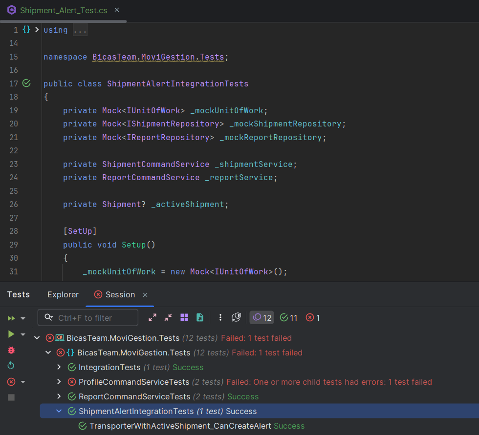

# Capítulo VI: Product Verification & Validation

## 6.1. Testing Suites & Validation

### 6.1.1. Core Entities Unit Tests.

Los Core Entities Unit Tests son esenciales en el desarrollo de software, ya que garantizan la calidad y
correcto funcionamiento de las entidades centrales, previniendo errores y facilitando el mantenimiento
del código.

**Todos los test**

**Profile Service Test**

**Report Service Test**

**Shipment Service Test**

**Vehicle Service Test**

### 6.1.2. Core Integration Tests.

Las pruebas de integración central son esenciales para verificar que los controladores se comuniquen correctamente con los demás componentes del sistema, como los servicios y las bases de datos. Al incluir escenarios de fallo, estas pruebas aseguran que el sistema reaccione apropiadamente ante situaciones imprevistas y devuelva los códigos de estado correspondientes. Esto no solo optimiza la experiencia del usuario, sino que también simplifica el proceso de depuración y promueve el desarrollo de un software robusto y de calidad.

**Vehicle Creation Integration Test**

**Vehicle Assigment Integration Test**

**Shipment Creation Integration Test**

**Shipment Alert Integration Test**

**Restrict Acces Integration Test**

### 6.1.3. Core Behavior-Driven Development

Modelo de todas las pruebas Behaviour-Driven Development realizadas en Cucumber

Gherkin tests for individual User Stories. Puedes usar este link para revisar todas las pruebas Gherkin: https://github.com/upc-DisenoDeExperimentos-LosTesters/upc-DisenoDeExperimentos-LosTesters-Gherkin/blob/main/us-04-visualizacion-de-envios-asignados.feature

### 6.1.4. Core System Tests.

En este proyecto se utilizó Selenium para llevar a cabo las pruebas de Core System Tests. Esta herramienta permite automatizar interacciones con la aplicación a través de su interfaz, lo que facilita la validación del comportamiento de los controladores en conjunto con otros componentes clave del sistema, como los servicios y las bases de datos. Las pruebas realizadas aseguran que ante distintos escenarios incluidos aquellos con errores el sistema responda correctamente, mejorando así la experiencia del usuario, facilitando la depuración y contribuyendo al desarrollo de un software confiable y de alta calidad.

**Mobile**

**Desktop**

## 6.2. Static testing & Verification

### 6.2.1. Static Code Analysis

El análisis estático del código es un pilar fundamental en la metodología de desarrollo de MoviGestión. Consiste en la inspección automatizada del código fuente sin necesidad de ejecutarlo, con el objetivo primordial de identificar tempranamente fallos potenciales, vulnerabilidades de seguridad y desviaciones de las buenas prácticas de programación. Este enfoque proactivo es vital para mantener una base de código robusta, optimizar la eficiencia del desarrollo y reducir la acumulación de deuda técnica a lo largo del ciclo de vida del proyecto. Dado que MoviGestión abarca un frontend web con Vue.js, un backend en .NET Framework y una aplicación móvil con Flutter, la estrategia de análisis estático se adapta a las particularidades de cada ecosistema tecnológico.

### 6.2.1.1. Coding stantard & Code conventions

La consistencia en el estilo y las convenciones de codificación es crucial para la legibilidad, mantenibilidad y la colaboración efectiva dentro del equipo de MoviGestión. Establecer y adherirse a un conjunto claro de directrices asegura que el código sea uniforme, fácil de comprender y modificar por cualquier desarrollador, independientemente de la tecnología específica. En MoviGestión, nos guiamos por los siguientes principios clave:

- Claridad y Expresividad: Adoptamos la filosofía de que el código debe ser autoexplicativo siempre que sea posible. Esto implica el uso de nombres completos y significativos para variables, funciones, clases y componentes, que reflejen claramente su propósito y el dominio de negocio (gestión de flotas, envíos, incidencias). Se prioriza la legibilidad sobre la brevedad, buscando que el flujo lógico del programa sea evidente a simple vista.
- Modularidad y Responsabilidad Única: Cada unidad de código (ya sea una función en Vue.js, un método en C# o un widget en Flutter) debe tener una única responsabilidad bien definida. Esto promueve la creación de componentes y servicios pequeños, cohesivos y fáciles de probar y mantener. En el backend de .NET, esto se manifiesta en una clara separación de capas; en el frontend web, en componentes Vue reutilizables; y en la aplicación Flutter, en la descomposición de la interfaz de usuario en widgets manejables.
- Uniformidad Estructural: Se establecen reglas específicas para el formato del código, incluyendo la indentación, el uso de espacios, la colocación de llaves y la organización de importaciones. Esta uniformidad, aplicada transversalmente en todos los lenguajes y frameworks de MoviGestión, elimina distracciones visuales y permite a los desarrolladores enfocarse en la lógica de negocio, no en las diferencias de estilo. Se utilizan herramientas de formato automatizadas para garantizar la adherencia constante a estas convenciones.

### 6.2.1.2. Code Quality & Code Security

Garantizar la alta calidad y la robustez del código es fundamental para la fiabilidad de MoviGestión, un sistema que gestiona operaciones críticas de flotas. Esto implica no solo la ausencia de errores, sino también la eficiencia, escalabilidad y seguridad inherente de la solución.

- Excelencia Técnica y Métricas: La calidad del código se evalúa y se busca optimizar de forma continua. Esto incluye monitorear métricas como la complejidad ciclomática, que indica la intrincación de los flujos de control del código, y la densidad de "code smells", que señala áreas con posibles problemas de diseño o mantenibilidad. La cobertura de pruebas automatizadas es otra métrica esencial, asegurando que las funcionalidades críticas de MoviGestión estén debidamente validadas. La plataforma SonarQube juega un rol clave en este monitoreo, proporcionando un panorama integral del "estado de salud" del código en todos los módulos del proyecto (Vue.js, .NET, Flutter).
- Seguridad Intrínseca: La seguridad es diseñada desde las primeras fases de desarrollo. Se implementan prácticas de codificación defensiva para mitigar vulnerabilidades comunes que podrían afectar la integridad de los datos de la flota o la privacidad de los usuarios. Esto incluye:
  - Validación Rigurosa de Entradas: Asegurar que todas las entradas de usuario, tanto en el frontend como en el backend, sean validadas y sanitizadas para prevenir ataques como inyección SQL, XSS o path traversal.
  - Gestión Segura de Dependencias: Realizar un escaneo regular de las bibliotecas y paquetes de terceros utilizados en Vue.js, .NET y Flutter para detectar y actualizar versiones con vulnerabilidades conocidas.
  - Principios de Menor Privilegio: Diseñar el acceso a los recursos y datos con el principio de mínimo privilegio, asegurando que los usuarios y los componentes del sistema solo tengan los permisos estrictamente necesarios.
- Integración de Detección Temprana (SonarLint): Para infundir una cultura de calidad y seguridad directamente en el flujo de trabajo diario de los desarrolladores, se utiliza SonarLint. Esta extensión se integra directamente en los IDEs (como Visual Studio para .NET y VS Code para Vue.js/Flutter) y proporciona retroalimentación instantánea sobre problemas de calidad y seguridad mientras el código está siendo escrito. Esto permite a los desarrolladores identificar y corregir posibles fallos de diseño, errores o vulnerabilidades en el momento de su creación, reduciendo la necesidad de correcciones costosas en etapas posteriores del desarrollo.

### 6.2.2. Reviews

Las revisiones de código son un pilar colaborativo en el proceso de desarrollo de MoviGestión, actuando como un complemento indispensable al análisis estático automatizado. Este proceso implica que los desarrolladores examinen y evalúen el código fuente escrito por sus compañeros.

- Propósitos Fundamentales:

  - Validación de Lógica y Diseño: Ir más allá de los problemas superficiales para identificar errores lógicos sutiles, ineficiencias o deficiencias en el diseño arquitectónico que las herramientas automáticas podrían pasar por alto.
  - Refuerzo de Estándares: Asegurar que el código no solo sea funcional, sino que también se adhiera a los principios de Clean Code, Modularidad y Uniformidad definidos para MoviGestión.
  - Fomento de la Seguridad Contextual: Un par de ojos humanos puede identificar vulnerabilidades de seguridad más complejas o específicas del dominio de la aplicación que no son detectables por patrones genéricos de análisis estático.
  - Intercambio de Conocimiento: Servir como una herramienta de aprendizaje y mentoría, permitiendo que el conocimiento sobre la base de código y las mejores prácticas se difunda entre el equipo, reduciendo la dependencia de un solo experto.
  - Mejora Continua: Impulsar una cultura de mejora constante, donde los comentarios constructivos llevan a soluciones más robustas, legibles y mantenibles.
- Metodología de Revisión en MoviGestión (Pull/Merge Requests):
Las revisiones en MoviGestión se articulan principalmente a través del proceso de Pull Requests (PRs) o Merge Requests (MRs), una práctica estándar en el desarrollo moderno basado en Git.

  - Flujo Operativo:

  1 . Cuando un desarrollador completa una tarea (sea una nueva funcionalidad para envíos, una mejora en la interfaz de reportes de incidentes, o una corrección en el backend de gestión de vehículos), crea un Pull Request. Este PR propone la integración de sus cambios en la rama de desarrollo principal. 
  2 . El PR es asignado a uno o más desarrolladores para su revisión. Estos revisores son responsables de analizar el código propuesto. 
  3 . La revisión abarca una evaluación exhaustiva, considerando aspectos como: 
    - La claridad y la documentación interna del código.
    - La adhesión a los principios de diseño y arquitectura de MoviGestión.
    - La eficiencia y el rendimiento de las soluciones implementadas (ej. consultas a base de datos, lógica de procesamiento).
    - El manejo adecuado de errores, casos excepcionales y la robustez ante entradas inesperadas.
    - La calidad y la cobertura de las pruebas unitarias y de integración asociadas al cambio.
    - La seguridad del código, buscando posibles vulnerabilidades o malas prácticas.
    - El impacto potencial del cambio en otras partes del sistema.

  4 . Los comentarios y sugerencias se realizan directamente en la plataforma del PR, facilitando el diálogo entre el autor y los revisores. 
  5 . El autor del PR es responsable de incorporar la retroalimentación y realizar las modificaciones necesarias hasta que el código satisfaga los estándares y reciba la aprobación de los revisores. 
  6 . Una vez aprobado, el código es fusionado en la rama de desarrollo, integrándose en la base de código de MoviGestión. 
- Herramientas de Soporte: La gestión de estos Pull Requests se realiza a través de la plataforma de control de versiones utilizada por el equipo (como GitLab, GitHub o Azure DevOps), que provee las herramientas necesarias para la colaboración, los comentarios en línea y el seguimiento del estado de cada revisión.

- Periodicidad: Las revisiones de código son un proceso continuo e integral, que se activa con cada propuesta de cambio significativo al codebase, garantizando un flujo de trabajo ágil que prioriza la calidad y la colaboración.

## 6.3. Validations Interviews

Con el fin de obtener y separar correctamente toda la información obtenida durante las entrevistas, se optó por definir un banco de preguntas según nuestro segmento de mercado identificado anteriormente. Este grupo de preguntas está especializado para la obtención de información específica según la persona entrevistada y según la problemática investigada para el proyecto y la posible solución en la forma de nuestro producto.

### 6.3.1. Diseño de Entrevistas

**Para los Empresarios:**

- ¿Cuál es su opinión general sobre la plataforma MoviGestion tras la demostración?
- ¿Qué características de MoviGestion le resultaron más útiles para la gestión de su flota?
- ¿Hay alguna función que no encontró en MoviGestion y que consideraría esencial para su operación?
- ¿Cómo evalúa la interfaz de usuario en términos de facilidad de uso y navegación?
- ¿Cuánto tiempo cree que le tomaría a su equipo adaptarse al uso de MoviGestion?
- ¿Cuáles son los principales desafíos que enfrenta actualmente en la gestión de su flota?
- ¿Cómo cree que MoviGestion podría ayudarle a superar esos desafíos?
- ¿Qué tan útil considera la funcionalidad de registro de incidencias en la plataforma?
- ¿Qué aspectos de la gestión de envíos exitosos le parecen más críticos para su operación?
- ¿Está dispuesto a recomendar MoviGestion a otros empresarios del sector? ¿Por qué?
- ¿Cómo valora la seguridad de la información y los datos en la plataforma MoviGestion?

**Para los Transportistas:**

- ¿Cuál fue su impresión general de la plataforma MoviGestion después de la demostración?
- ¿Qué tan fácil le resultó navegar y utilizar las funciones de MoviGestion?
- ¿Qué características de MoviGestion le parecieron más útiles para su trabajo diario?
- ¿Hay alguna función que no encontró en MoviGestion y que consideraría útil para su labor?
- ¿Cómo cree que MoviGestion podría ayudarle a realizar su trabajo de manera más eficiente?
- ¿Qué tan útil considera la funcionalidad de registro de incidencias para reportar problemas en tiempo real?
- ¿Qué tan fácil le resultó el proceso de seguimiento de envíos en MoviGestion?
- ¿Cómo valora la capacidad de monitorear los sitios de entrega a través de la plataforma?
- ¿Le parece intuitiva la interfaz de usuario de MoviGestion? ¿Hay algo que cambiaría?
- ¿Cómo le gustaría que MoviGestion le notificara sobre nuevas tareas o cambios en las entregas?
- ¿Qué mejoras le gustaría ver en futuras actualizaciones de la plataforma?
- ¿Cómo valora la seguridad de la información y los datos en la plataforma MoviGestion?
- ¿Cree que MoviGestion le ayudaría a reducir el tiempo de inactividad y aumentar la productividad?
- ¿Estaría dispuesto a recomendar MoviGestion a otros transportistas? ¿Por qué?

### 6.3.2. Registro de Entrevistas

1. ### **_Segmento objetivo: Empresarios_**
   **Entrevista N°1:**

- **Datos principales:**
- **Nombre completo del entrevistado:** Abraham Quenta
- **Edad:** 28 años
- **Distrito:** Tacna
- **Link:** https://upcedupe-my.sharepoint.com/:v:/g/personal/u20191a453_upc_edu_pe/ERl5IIXzz4FArsqJHHlEohABGg35OtX4K-X123ewVpRjIw?e=k2DFxD&nav=eyJyZWZlcnJhbEluZm8iOnsicmVmZXJyYWxBcHAiOiJTdHJlYW1XZWJBcHAiLCJyZWZlcnJhbFZpZXciOiJTaGFyZURpYWxvZy1MaW5rIiwicmVmZXJyYWxBcHBQbGF0Zm9ybSI6IldlYiIsInJlZmVycmFsTW9kZSI6InZpZXcifX0%3D
- **Inicio de la entrevista:** 0:00
- **Duración:** 10:45
- **Resumen:** Abraham se presenta como un profesional del transporte con 5 años de experiencia en el sector transporte provincial, cuya ruta principal es de Tacna a Puno. Comenta sobre la página de destino de su servicio, que incluye información sobre los servicios ofrecidos y permite la personalización del idioma. Abraham explora las características y funcionalidades del sitio web, como la gestión de la flota, los informes de los conductores y la gestión de vehículos, y aprecia el aspecto organizativo de la plataforma, señalando que es fácil encontrar las funciones deseadas. Abraham menciona algunos problemas menores con la visibilidad del texto y la navegación, pero en general considera que la interfaz de usuario es clara y sencilla. información del vehículo, así como las estrategias de marketing y el diseño de la página de destino, pero en general. considera que la aplicación es valiosa, especialmente para monitorear las actividades de los conductores.

**Entrevista N°2:**

- **Datos principales:**
- **Nombre completo del entrevistado:** Gustavo Manrique
- **Edad:** 40 años
- **Distrito: Chorrillos**
- **Link:** https://upcedupe-my.sharepoint.com/:v:/g/personal/u20191a453_upc_edu_pe/ERl5IIXzz4FArsqJHHlEohABGg35OtX4K-X123ewVpRjIw?e=k2DFxD&nav=eyJyZWZlcnJhbEluZm8iOnsicmVmZXJyYWxBcHAiOiJTdHJlYW1XZWJBcHAiLCJyZWZlcnJhbFZpZXciOiJTaGFyZURpYWxvZy1MaW5rIiwicmVmZXJyYWxBcHBQbGF0Zm9ybSI6IldlYiIsInJlZmVycmFsTW9kZSI6InZpZXcifX0%3D
- **Inicio de la entrevista:** 10:46
- **Duración:** 6:40
- **Resumen:** El empresario Gustavo Manrique expresó una opinión muy bien sobre MoviGestion, destacando la utilidad de las estadísticas de rendimiento y el seguimiento de envíos exitosos. Considera que la plataforma es fácil de usar y que su equipo podría adaptarse rápidamente. También, identificó como desafíos principales el seguimiento de envíos, gestión de incidencias y optimización de rutas, áreas donde cree que MoviGestion puede ayudar significativamente. Mencionó la necesidad de una herramienta para la optimización de rutas en tiempo real. Valora altamente la seguridad de la información y está dispuesto a recomendar la plataforma a otros empresarios del sector.

**Entrevista N°3:**

- **Datos principales:**
- **Nombre completo del entrevistado:** Marco Tarazona
- **Edad:** 57 años
- **Distrito:** Puente Piedra
- **Link:** https://upcedupe-my.sharepoint.com/:v:/g/personal/u20191a453_upc_edu_pe/ERl5IIXzz4FArsqJHHlEohABGg35OtX4K-X123ewVpRjIw?e=k2DFxD&nav=eyJyZWZlcnJhbEluZm8iOnsicmVmZXJyYWxBcHAiOiJTdHJlYW1XZWJBcHAiLCJyZWZlcnJhbFZpZXciOiJTaGFyZURpYWxvZy1MaW5rIiwicmVmZXJyYWxBcHBQbGF0Zm9ybSI6IldlYiIsInJlZmVycmFsTW9kZSI6InZpZXcifX0%3D
- **Inicio de la entrevista:** 17:34
- **Duración:** 2:17
- **Resumen:** El empresario Marco Tarazona expresó una opinión positiva sobre MoviGestion, resaltando su utilidad para la gestión de flotas, especialmente en el seguimiento de envíos y la gestión de incidencias. Mencionó la facilidad de uso de la plataforma y consideró que su equipo podría adaptarse rápidamente. Identificó como posible desafio la optimización de rutas y la necesidad de integración con otros sistemas. Además, valora la seguridad de la información y está dispuesto a recomendar MoviGestion a otros empresarios del sector.

**Segmento objetivo: Transportistas**

**Entrevista N°1:**

- **Datos principales:**
- **Nombre completo del entrevistado:** Renzo Cesar Silva Morales
- **Edad:** 24 años
- **Distrito:** Santiago de Surco
- **Link:** https://upcedupe-my.sharepoint.com/:v:/g/personal/u20191a453_upc_edu_pe/ERl5IIXzz4FArsqJHHlEohABGg35OtX4K-X123ewVpRjIw?e=k2DFxD&nav=eyJyZWZlcnJhbEluZm8iOnsicmVmZXJyYWxBcHAiOiJTdHJlYW1XZWJBcHAiLCJyZWZlcnJhbFZpZXciOiJTaGFyZURpYWxvZy1MaW5rIiwicmVmZXJyYWxBcHBQbGF0Zm9ybSI6IldlYiIsInJlZmVycmFsTW9kZSI6InZpZXcifX0%3D
- **Inicio de entrevista:** 19:43
- **Duración:** 7:50
- **Resumen:** Renzo es un transportista que recién está comenzando en el negocio, tuvo una experiencia inicial positiva con la plataforma. En donde destaca las secciones que tenemos implementadas por su funcionalidad. La interfaz le pareció amigable y fácil de usar, pero encontró algunas dificultades técnicas. Considera que sería beneficioso añadir seguimiento en tiempo real para envíos, notificaciones automáticas y soporte por chat en vivo. Aunque las opciones actuales son útiles, a él le gustaría tener más información detallada en cada apartado. Por último, sugiere la inclusión de tutoriales interactivos para que los nuevos usuarios puedan familiarizarse.

**Entrevista N°2:**

- **Datos principales:**
- **Nombre completo del entrevistado:** Ricardo Chate Flores
- **Edad:** 45 años
- **Distrito:** Cercado de Lima
- **Link:** https://upcedupe-my.sharepoint.com/:v:/g/personal/u20191a453_upc_edu_pe/ERl5IIXzz4FArsqJHHlEohABGg35OtX4K-X123ewVpRjIw?e=k2DFxD&nav=eyJyZWZlcnJhbEluZm8iOnsicmVmZXJyYWxBcHAiOiJTdHJlYW1XZWJBcHAiLCJyZWZlcnJhbFZpZXciOiJTaGFyZURpYWxvZy1MaW5rIiwicmVmZXJyYWxBcHBQbGF0Zm9ybSI6IldlYiIsInJlZmVycmFsTW9kZSI6InZpZXcifX0%3D
- **Inicio de entrevista:** 28:01
- **Duración:** 8:00
- **Resumen:** El transportista Ricardo Chate Flores expresó una opinión positiva sobre MoviGestion, destacando su facilidad de uso y navegación intuitiva. Consideró útiles las funciones de registro de incidencias y seguimiento de envíos para su trabajo diario. Valora la capacidad de monitorear los sitios de entrega y mencionó que la plataforma podría ayudarle a trabajar de manera más eficiente. Aunque satisfecho con las funcionalidades actuales, sugirió la necesidad de notificaciones más personalizables. José destacó la seguridad de la información y está dispuesto a recomendar MoviGestion a otros transportistas, ya que cree que puede reducir el tiempo de inactividad y aumentar la productividad.

**Entrevista N°3:**

- **Datos principales:**
- **Nombre completo del entrevistado:** Víctor Cuba Bautista
- **Edad:** 42 años
- **Distrito:** Villa El Salvador
- **Link:** https://upcedupe-my.sharepoint.com/:v:/g/personal/u20191a453_upc_edu_pe/ERl5IIXzz4FArsqJHHlEohABGg35OtX4K-X123ewVpRjIw?e=k2DFxD&nav=eyJyZWZlcnJhbEluZm8iOnsicmVmZXJyYWxBcHAiOiJTdHJlYW1XZWJBcHAiLCJyZWZlcnJhbFZpZXciOiJTaGFyZURpYWxvZy1MaW5rIiwicmVmZXJyYWxBcHBQbGF0Zm9ybSI6IldlYiIsInJlZmVycmFsTW9kZSI6InZpZXcifX0%3D
- **Inicio de entrevista:** 35:37
- **Duración:** 4:50
- **Resumen:** El transportista Víctor Cuba Bautista tras probar la plataforma, reconoció que el uso de las funciones eran más sencillos de lo que esperaba. Encontró especialmente útil el registro de incidencias en tiempo real. Aunque le gustaría ver mejoras en algunas funcionalidades adicionales, valora la capacidad de monitorear los sitios de entrega y la seguridad de los datos proporcionada por la plataforma. Al final, Víctor concluyó que MoviGestion es una herramienta efectiva que puede mejorar su eficiencia y reducir el tiempo de inactividad, y estaría dispuesto a recomendarla a otros transportistas.

### 6.3.3. Evaluaciones según heurísticas

Esta sección contiene el proceso de evaluación de las sesiones de validación basado en heurísticas, considerando heurísticas de usabilidad, arquitectura de información e inclusive design de la experiencia propuesta. Para esto la sección usamos la estructura del formato para evaluaciones de heurísticas indicado.

**UX Heuristics & Principles Evaluation**

**Usability – Inclusive Design – Information Architecture**
\*\*\*

**CARRERA : Ingeniería de Software**

**CURSO : Aplicaciones Web**

**SECCIÓN : SV51**

**PROFESORES : Angel Augusto Velasquez Nuñez**

**AUDITOR : Bicas Team**

**CLIENTE : MoviGestion**

1. ## \*\*

   **SITE o APP A EVALUAR:**

   **MoviGestion**

   **TAREAS A EVALUAR:**

   _El alcance de esta evaluación incluye la revisión de la usabilidad de las siguientes tareas:_

_1._ _Gestión y edición de perfil de usuario._

_2. Visualización de asignación de envíos que pertenecen a cada transportista_

_3. Agregar un nuevo vehículo a la flota de vehículos._

_4. Eliminar un vehículo de la flota de vehículos._

_5. Visualización de alertas de cada transportista._

**ESCALA DE SEVERIDAD:**

_Los errores serán puntuados tomando en cuenta la siguiente escala de severidad_

| **_Nivel_** | **_Descripción_**                                                                                                                                                                                                                                       |
| :---------- | :------------------------------------------------------------------------------------------------------------------------------------------------------------------------------------------------------------------------------------------------------ |
| _1_         | _Problema superficial: puede ser fácilmente superado o hasta ignorado por el usuario ó ocurre con muy poca frecuencia. El error no necesita ser arreglado de forma inmediata en la mayoría de las casos, a no ser que exista disponibilidad de tiempo._ |
| _2_         | _Problema menor: puede ocurrir un poco más frecuentemente o es un poco más difícil de superar para el usuario. Se le debería asignar una prioridad baja para resolverlo de cara antes de la siguiente entrega o actualización._                         |
| _3_         | _Problema mayor: ocurre frecuentemente o los usuarios no son capaces de resolverlos. Es importante que sean corregidos y se les debe asignar una prioridad alta._                                                                                       |
| _4_         | _Problema muy grave: un error de gran impacto que impide al usuario continuar con el uso de la herramienta. Es imperativo que sea corregido antes del lanzamiento._                                                                                     |

**TABLA RESUMEN:**

| _#_ |                                                 _Problema_                                                 | _Escala de severidad_ |        _Heurística/Principio violada(o)_        |
| :-: | :--------------------------------------------------------------------------------------------------------: | :-------------------: | :---------------------------------------------: |
| _1_ |                         _Incluye un botón “See More” pero no tiene funcionalidad_                          |          _3_          |    _Information Architecture: Is it usable?_    |
| _2_ | _No parece haber consistencia en la forma en que se presentan las opciones para actualizar la información_ |          _2_          |     _Usability: Consistencia y estándares_      |
| _3_ |                            _Información de pagos no está claramente presentada_                            |          _3_          | _Usability: Visibilidad del estado del sistema_ |
| _4_ |                             _No funciona cancelar el agregado de un vehículo._                             |          _2_          |   _Usability: Libertad y control del usuario_   |

**DESCRIPCIÓN DE PROBLEMAS:**

_PROBLEMA #1:_

_Severidad: 3_

_Heurística violada: Information Architecture: Is it usable?_

_Problema:_

_La aplicación incluye un botón “See More” pero no tiene funcionalidad, lo que confunde a los usuarios y les impide acceder a contenido adicional esperado._

_Recomendación:_

_Eliminar el botón “See More” si no hay contenido adicional disponible, o implementar la funcionalidad esperada para que los usuarios puedan acceder a más información._

_PROBLEMA #2:_

_Severidad: 2_

_Heurística violada: Usability - Consistencia y estándares_

_Problema:_

_La interfaz de Settings incluye campos para Nickname, Bio, Email y Avatar, pero no parece haber consistencia en la forma en que se presentan las opciones para actualizar la información. Por ejemplo, el botón ‘Choose’ para actualizar el avatar está separado del campo ‘Avatar’, lo que podría confundir a los usuarios._

_Recomendación:_

_Asegurar que todos los campos de entrada y botones relacionados estén agrupados de manera coherente y clara para mejorar la comprensión y la facilidad de uso._

_PROBLEMA #3:_

_Severidad: 3_

_Heurística violada: Usability: Visibilidad del estado del sistema_

_Problema:_

_La información relacionada con Organization no está claramente presentada, lo que puede causar confusión a la hora de querer tener información y dificulta la asignación de envíos._

_Recomendación:_

_Mejorar la presentación y accesibilidad de la información relacionada con "Organization" puede mejorar significativamente la experiencia del usuario y facilitar la asignación de envíos en la aplicación._

_PROBLEMA #4:_

_Severidad: 2_

_Heurística violada: Usability: Libertad y control del usuario_

_Problema:_

_Al momento de ingresar los datos del nuevo vehículo, no se puede cerrar hasta darle darle al botón “Close” y luego se tiene que eliminar en el botón “Delete Vehicle”, esto obliga a agregar nuevos carros no deseados, también incrementando así la cantidad de esfuerzo del usuario._

_Recomendación:_

_Hacer que el botón "Close" tenga la funcionalidad para cerrar la ventana emergente sin guardar los datos del vehículo ingresados._

---

## 6.4. Auditoría de Experiencias de Usuario.

La auditoría de experiencias de usuario es un proceso clave para evaluar la efectividad, accesibilidad y satisfacción que ofrece una interfaz digital a sus usuarios. A través de un análisis detallado de cada punto de interacción, esta auditoría permite identificar fricciones, inconsistencias y oportunidades de mejora que impactan directamente en la usabilidad y la percepción del producto. Su objetivo es asegurar que la experiencia ofrecida sea intuitiva, eficiente y alineada con las necesidades y expectativas del público objetivo.

### 6.4.1. Auditoría realizada.

Se realizó una auditoría de experiencias de usuario para identificar problemas de usabilidad y mejorar la interacción con la interfaz, enfocándose en la eficiencia y satisfacción del usuario.

#### 6.4.1.1. Información del grupo auditado.

El grupo auditado estuvo compuesto por usuarios representativos del público objetivo, seleccionados según su perfil, nivel de experiencia y frecuencia de uso del sistema.

- Nombre del responsable de auditoría: **LosTesters**
- Especialización: Especialistas en diseño de interfaces (UI), accesibilidad web y
  evaluación de experiencias inclusivas.
- Fecha de auditoría: 14/06/2025 - 21/06/2025
- Herramientas utilizadas:
  - Selenium, para simular interacciones de usuario y detectar posibles problemas en los flujos de navegación.
  - Lighthouse, para evaluar el rendimiento, la accesibilidad, las mejores prácticas y el SEO de la interfaz.
  - WebPageTest, para medir tiempos de carga y rendimiento desde diferentes ubicaciones y dispositivos.
  - RedLine13, utilizada para pruebas de carga y rendimiento en escenarios de alto tráfico.
  - Otras herramientas complementarias conocidas fueron empleadas para obtener una visión integral del comportamiento y la experiencia del usuario.

#### 6.4.1.2. Cronograma de auditoría realizada.

El siguiente cronograma detalla las fases y fechas clave en las que se llevó a cabo la auditoría de experiencias de usuario. Cada etapa fue organizada de forma secuencial para asegurar una evaluación completa, desde la planificación inicial hasta la presentación de hallazgos y recomendaciones.

| Fecha      | Actividad                                                                | Responsable        |
| ---------- | ------------------------------------------------------------------------ | ------------------ |
| 14/06/2025 | Análisis de resultados y redacción del informe preliminar                | Fabrizio Sanchez   |
| 14/06/2025 | Revisión cruzada del informe y validación de hallazgos                   | Juan Cueto         |
| 14/06/2025 | Presentación de resultados y recomendaciones de mejora al equipo cliente | Flavio Trigueros   |
| 15/06/2025 | Revisión del diseño visual con base en los hallazgos                     | Aldhair Valenzuela |
| 16/06/2025 | Implementación de ajustes de accesibilidad                               | Piero Tarazona     |
| 17/06/2025 | Optimización del rendimiento basada en métricas de Lighthouse            | Juan Cueto         |
| 18/06/2025 | Pruebas de regresión automatizadas con Selenium                          | Juan Cueto         |
| 19/06/2025 | Validación final con usuarios                                            | Fabrizio Sanchez   |
| 20/06/2025 | Recopilación de feedback posterior a ajustes                             | Flavio Trigueros   |
| 21/06/2025 | Elaboración del informe final de auditoría                               | Aldhair Valenzuela |

#### 6.4.1.3. Contenido de auditoría realizada.

La auditoría abarcó una revisión integral de la experiencia de usuario, evaluando aspectos como la usabilidad, el rendimiento, la accesibilidad y la eficiencia del sistema. Se analizaron distintos flujos de navegación, tiempos de carga, consistencia visual e interacción del usuario mediante herramientas automatizadas y criterios estandarizados, con el fin de identificar áreas de mejora y asegurar una experiencia óptima.

| #   | Problema                                                                                                                                              | Escala de severidad | Heurística/Principio violado(a)                                  |
| --- | ----------------------------------------------------------------------------------------------------------------------------------------------------- | ------------------- | ---------------------------------------------------------------- |
| 1   | El contraste entre el texto rojo oscuro y el fondo negro en la pantalla principal dificulta la lectura, especialmente para usuarios con baja visión.  | 3                   | Accesibilidad; Estética y diseño minimalista                     |
| 2   | El logo y los botones en el header se ven muy pequeños en resoluciones altas, lo que afecta su visibilidad y comprensión.                             | 2                   | Estética y diseño minimalista; Consistencia y estándares         |
| 3   | Los botones de navegación como “Sign In” y “Home” no tienen etiquetas accesibles (`aria-label`), lo cual dificulta su uso con lectores de pantalla.   | 4                   | Accesibilidad; Ayuda y documentación                             |
| 4   | La interfaz de los módulos (fermentación, clarificación, etc.) no mantiene una jerarquía visual clara entre las secciones, generando confusión.       | 2                   | Consistencia y estándares                                        |
| 5   | No hay retroalimentación visual (loading, confirmación) al presionar botones como “Export” o “New”, lo que puede generar incertidumbre en el usuario. | 3                   | Visibilidad del estado del sistema; Prevención de errores        |
| 6   | Las validaciones de los formularios no explican con claridad qué se requiere, solo indican que un campo es obligatorio sin mayor contexto.            | 2                   | Prevención de errores; Ayuda y documentación                     |
| 7   | No se observa un modo claro para modificar o visualizar en detalle los registros ingresados, lo que limita la flexibilidad del sistema.               | 2                   | Flexibilidad y eficiencia de uso; Control y libertad del usuario |
| 8   | El cambio de idioma (EN/ES) no aplica a todo el contenido de la página, afectando la coherencia para usuarios que no dominan ambos idiomas.           | 3                   | Consistencia y estándares; Flexibilidad y eficiencia de uso      |
| 9   | No se permite cambiar el tamaño del texto ni se detecta compatibilidad con funciones de zoom del navegador, afectando la accesibilidad.               | 4                   | Accesibilidad                                                    |
| 10  | Algunos formularios (como el de registro) presentan criterios visuales muy estrictos para contraseñas, pero no incluyen ayuda contextual al respecto. | 3                   | Prevención de errores; Ayuda y documentación                     |

### 6.4.2. Auditoría recibida.

La auditoría recibida permitió obtener una visión objetiva y detallada sobre el estado actual de la experiencia de usuario en el sistema evaluado. A través de los hallazgos presentados, se identificaron fortalezas, debilidades y recomendaciones clave que servirán como base para futuras mejoras en diseño, accesibilidad y rendimiento.

#### 6.4.2.1. Información del grupo auditor.

El grupo auditor estuvo conformado por especialistas en experiencia de usuario, accesibilidad y rendimiento web. Contaban con conocimientos en herramientas como Selenium, Lighthouse y WebPageTest, lo que permitió realizar una evaluación técnica y centrada en el usuario, garantizando resultados precisos y relevantes para la mejora del sistema.

- Nombre del responsable de auditoría: **EventWine**
- Especialización: Especialistas en diseño de interfaces (UI), accesibilidad web y
  evaluación de experiencias inclusivas.
- Fecha de auditoría: 14/06/2025 - 20/06/2025
- Herramientas utilizadas:
  - Selenium, para simular interacciones de usuario y detectar posibles problemas en los flujos de navegación.
  - Lighthouse, para evaluar el rendimiento, la accesibilidad, las mejores prácticas y el SEO de la interfaz.
  - WebPageTest, para medir tiempos de carga y rendimiento desde diferentes ubicaciones y dispositivos.
  - RedLine13, utilizada para pruebas de carga y rendimiento en escenarios de alto tráfico.
  - Otras herramientas complementarias conocidas fueron empleadas para obtener una visión integral del comportamiento y la experiencia del usuario.

#### 6.4.2.2. Cronograma de auditoría recibida.

El cronograma de la auditoría recibida detalla las fechas y actividades realizadas por el equipo auditor durante cada fase del proceso. Desde la evaluación inicial hasta la entrega del informe final, cada etapa se llevó a cabo de manera estructurada para garantizar una revisión completa, precisa y alineada con los objetivos del análisis.

| Fecha      | Actividad                                                                         | Responsable     |
| ---------- | --------------------------------------------------------------------------------- | --------------- |
| 14/06/2025 | Evaluación de accesibilidad automática con Lighthouse y WebPageTest               | Deybbi Crisanto |
| 14/06/2025 | Simulación de navegación con lector de pantalla (NVDA)                            | Moises Donayre  |
| 15/06/2025 | Análisis de estructura de navegación y flujos críticos                            | Gustavo Huanca  |
| 15/06/2025 | Revisión de formularios: validaciones, mensajes de error y campos obligatorios    | July Paico      |
| 16/06/2025 | Verificación del contraste de colores y jerarquía visual según estándares WCAG    | Jesús Paucar    |
| 16/06/2025 | Evaluación de consistencia de íconos, botones y etiquetas en diferentes vistas    | Moises Donayre  |
| 17/06/2025 | Pruebas de cambio de idioma (i18n) y cobertura de traducciones EN/ES              | July Paico      |
| 17/06/2025 | Revisión de tiempos de carga y rendimiento (RedLine13 y WebPageTest)              | Gustavo Huanca  |
| 18/06/2025 | Detección de errores de diseño en pantallas de registro, login y módulos internos | Jesús Paucar    |
| 18/06/2025 | Documentación de hallazgos críticos y clasificación por severidad                 | Deybbi Crisanto |
| 19/06/2025 | Elaboración de propuestas de mejora visual, estructural y de contenido            | July Paico      |
| 19/06/2025 | Sesión de revisión interna de observaciones y ajustes sugeridos                   | Moises Donayre  |
| 20/06/2025 | Redacción del informe final con capturas, evidencias y criterios heurísticos      | Gustavo Huanca  |
| 20/06/2025 | Presentación oficial de hallazgos y entregables al equipo de desarrollo y cliente | Deybbi Crisanto |

#### 6.4.2.3. Contenido de auditoría recibida.

El contenido de la auditoría recibida incluye un análisis detallado de la interfaz evaluada, considerando aspectos como accesibilidad, tiempos de carga, usabilidad y consistencia visual. Los resultados se sustentan en métricas objetivas y observaciones técnicas, acompañados de recomendaciones concretas para optimizar la experiencia del usuario y mejorar el rendimiento general del sistema.

| #   | Problema                                                                                                                                                       | Escala de severidad | Heurística/Principio violado(a)                                   |
| --- | -------------------------------------------------------------------------------------------------------------------------------------------------------------- | ------------------- | ----------------------------------------------------------------- |
| 1   | Los textos de botones como "Ver Detalle" o "Registrar" presentan bajo contraste con el fondo, dificultando su visualización para usuarios con visión reducida. | 3                   | Accesibilidad; Estética y diseño minimalista                      |
| 2   | El mismo modelo y placa de vehículo se repite varias veces (ej. ABC123), lo que puede causar confusión al usuario.                                             | 3                   | Consistencia y estándares                                         |
| 3   | Algunas imágenes de perfil no cargan o muestran íconos rotos (ej. avatar en la sección de perfil), lo que afecta la percepción de calidad.                     | 2                   | Estética y diseño minimalista; Visibilidad del estado del sistema |
| 4   | En el formulario de registro de vehículo, los campos de ID no tienen validación ni etiquetas explicativas, lo que puede confundir al usuario.                  | 3                   | Ayuda y documentación; Prevención de errores                      |
| 5   | No se indica visualmente qué campos son obligatorios en formularios como "Editar Perfil" o "Registrar Vehículo".                                               | 2                   | Prevención de errores; Estética y diseño minimalista              |
| 6   | La información de los reportes no se puede filtrar o buscar, lo cual dificulta la eficiencia en sistemas con grandes volúmenes de datos.                       | 2                   | Flexibilidad y eficiencia de uso                                  |
| 7   | No existe retroalimentación al guardar cambios en el perfil, como un mensaje de éxito o error.                                                                 | 2                   | Visibilidad del estado del sistema                                |
| 8   | Algunos textos y componentes están desalineados visualmente (ej. títulos de tarjetas de reporte), afectando la estética general del sistema.                   | 1                   | Estética y diseño minimalista                                     |

#### 6.4.2.4. Resumen de modificaciones para subsanar hallazgos.

A partir de los hallazgos identificados durante la auditoría, se implementaron una serie de modificaciones orientadas a mejorar la experiencia de usuario. Estas acciones incluyeron ajustes en el diseño visual, optimización del rendimiento, corrección de errores de accesibilidad y mejoras en la navegación. Cada cambio fue realizado con el objetivo de subsanar las observaciones detectadas y garantizar una interacción más fluida, intuitiva y eficiente para los usuarios finales.

|   # | Problema                                                                             | Subsanación                                                                                            |
| --: | ------------------------------------------------------------------------------------ | ------------------------------------------------------------------------------------------------------ |
|   1 | El avatar cargado no se muestra correctamente en el formulario de edición de perfil. | Corregir la lógica de visualización del avatar, asegurando que la imagen se renderice tras la carga.   |
|   2 | No se visualiza feedback al guardar cambios en el perfil.                            | Añadir un mensaje de éxito (toast/snackbar) visible al usuario luego de guardar correctamente.         |
|   3 | El botón de 'Save Changes' no tiene una animación que indique procesamiento.         | Agregar una animación de carga o estado de espera al presionar 'Save Changes'.                         |
|   4 | Falta validación visual de campos requeridos vacíos.                                 | Resaltar los campos vacíos requeridos con un borde rojo y mensaje de validación.                       |
|   5 | No hay consistencia entre los estilos del menú lateral y el formulario central.      | Unificar estilos visuales para garantizar cohesión entre la interfaz lateral y el contenido principal. |
|   6 | La barra lateral tiene bajo contraste con el fondo, afectando la legibilidad.        | Ajustar el contraste de la barra lateral usando colores que cumplan estándares WCAG.                   |
|   7 | No se redirige al usuario tras guardar exitosamente el perfil.                       | Implementar una redirección automática o confirmación persistente tras el guardado.                    |
|   8 | Falta un placeholder representativo en el campo 'Bio'.                               | Agregar texto guía en el campo 'Bio' que sugiera el tipo de información esperada.                      |
