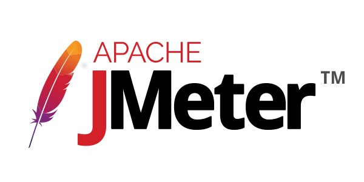
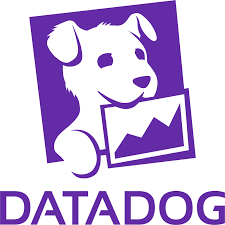
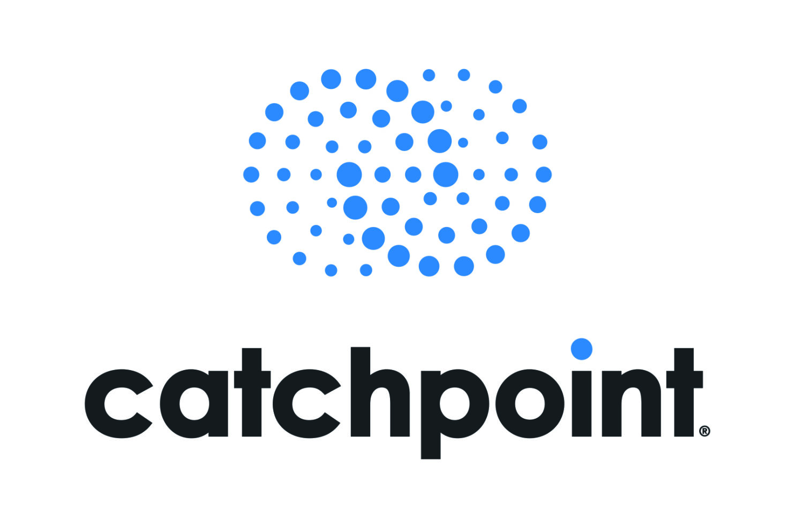
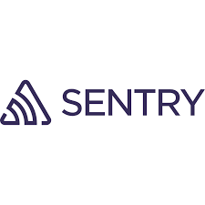
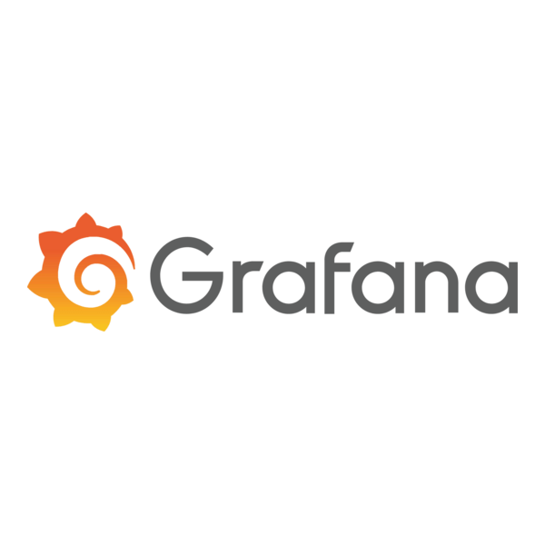

# Capítulo VII: DevOps Practices

En este capítulo se describen las prácticas y herramientas DevOps adoptadas en MoviGestión para orquestar de forma integrada el ciclo de vida completo del software, desde la escritura y el control de versiones del código hasta el despliegue en producción y la monitorización continua. El objetivo es cerrar la brecha entre desarrollo y operaciones, incrementando la velocidad de entrega, la fiabilidad de las versiones y la capacidad de respuesta ante incidencias. A lo largo de este capítulo se detallarán los procesos de Integración Continua, Entrega Continua, Despliegue Continuo y Monitoreo Continuo, así como los componentes de los pipelines que soportan cada etapa, garantizando calidad, seguridad y trazabilidad en cada iteración.

## 7.1. Continuous Integration

La Integración Continua (CI) es la práctica de fusionar con frecuencia los cambios de código de todos los desarrolladores en un repositorio compartido y validar automáticamente cada cambio mediante compilaciones y pruebas. En MoviGestión, la CI desempeña un papel crítico para detectar defectos de forma temprana, evitar regresiones y mantener la salud de la base de código. A continuación se presentan las herramientas y métodos empleados para implementar una CI robusta, así como los componentes clave de nuestro pipeline de compilación y pruebas que aseguran retroalimentación inmediata y confiable tras cada push o pull request.

### 7.1.1. Tools and Practices.

En el desarrollo de MoviGestión, adoptamos un enfoque integral basado en estándares y buenas prácticas que garantizan tanto la excelencia técnica como la alineación continua con los objetivos de negocio. Para ello, hemos estructurado nuestro proceso de integración continua en torno a tres ejes fundamentales para la validación de la funcionalidad y el comportamiento previsto de la aplicación:

* **Control de versiones riguroso:**

    Todas las modificaciones al código fuente se gestionan en GitHub bajo un modelo GitFlow Workflow que distingue:
    
    * Ramas de desarrollo (develop)
  
    * Características (feature/*)
  
    * Corrección de errores (hotfix/*)
  
    * Versiones de producción (main)

    Asimismo, empleamos Conventional Commits para uniformar los mensajes de cambios y facilitar la generación automática de Semantic Versioning (vMAJOR.MINOR.PATCH), lo cual asegura trazabilidad, visibilidad de dependencias y una estrategia de despliegue predecible.
     
* **Integración continua (CI) automatizada**

    Cada push o pull request activa en GitHub Actions un pipeline que incluye:

    * Compilación del código y resolución de dependencias,

    * Análisis estático para detectar defectos o vulnerabilidades de manera temprana,

    * Pruebas unitarias (TDD) para validar individualmente cada componente.
  
    Este ciclo permite identificar y corregir errores en fases iniciales, reduciendo el costo de la remediación y elevando la estabilidad de la base de código.

* **Lenguaje común de requisitos y validación**

    Para alinear el desarrollo con las expectativas de los usuarios y stakeholders, combinamos:

    * Test‑Driven Development (TDD), que fomenta la creación de casos de prueba antes de escribir la funcionalidad, garantizando cobertura y fiabilidad.

    * Behavior‑Driven Development (BDD), que utiliza escenarios escritos en Gherkin para describir el comportamiento esperado desde la perspectiva del negocio. De este modo, cada historia de usuario se traduce en ejemplos ejecutables que sirven de guía y validación durante todo el ciclo de vida del proyecto.

Este marco metodológico, respaldado por herramientas especializadas, nos permite entregar nuevas versiones de MoviGestión con la confianza de que cumplen rigurosamente los requisitos funcionales, mantienen altos estándares de calidad técnica y minimizan riesgos en el proceso de despliegue.

###### Tabla #

*Listado de herramientas empleadas por el equipo de trabajo de Movigestión para sus procesos de Integración Continua*

| Herramienta | Tipo | Descripción | Propósito |
|-------------|------|-------------|-----------|
| GitHub y GitFlow | Control de versiones | Repositorio central en GitHub, que emplea el modelo GitFlow para gestionar ramas de desarrollo (develop), producción (main), características y corrección de errores |	Garantizar trazabilidad de cambios, permitir desarrollos paralelos y establecer un proceso ordenado de lanzamientos | 
| Conventional Commits | Control de versiones (convención) | Convención estandarizada de mensajes de commit (feat:, fix:, docs:, chore:) que, junto con etiquetas de Versionado Semántico (vX.Y.Z), automatiza la generación de changelogs | Facilitar la comprensión del historial de cambios, el versionado semántico y la automatización de releases | 
| GitHub Actions | Integración continua (CI) / Entrega Continua (CD) | Plataforma de CI/CD integrada en GitHub, que orquesta workflows declarativos para ejecutar pasos de checkout, compilación, análisis estático, pruebas y empaquetado |  Automatizar validaciones en cada push o pull request, reduciendo errores y acelerando el feedback al equipo | 
| NUnit | Pruebas unitarias (TDD) | Frameworks de testing para C#, que permiten definir y ejecutar pruebas de unidades de código de forma aislada | Verificar el correcto funcionamiento de métodos y componentes en fases tempranas, garantizando cobertura y robustez |
| Moq | Simulaciones / Mocks (TDD) | Bibliotecas que crean objetos simulados para sustituir dependencias externas en pruebas unitarias, aislando la lógica de negocio | Asegurar el comportamiento de la lógica interna sin depender de servicios o módulos externos, aumentando la fiabilidad |
| Cucumber | Pruebas de comportamiento (BDD) | Herramienta que interpreta escenarios escritos en lenguaje Gherkin, traduciendo requisitos de negocio en pruebas automatizadas de extremo a extremo | Validar flujos y criterios de aceptación desde la perspectiva del usuario, manteniendo alineación con el negocio |
| OWASP Dependency‑Check | Escaneo de seguridad	| Herramienta que revisa las bibliotecas y dependencias del proyecto en busca de vulnerabilidades conocidas y avisos de seguridad | Prevenir la incorporación de componentes inseguros en el stack, reforzando la postura de seguridad de la aplicación |
| Postman y Newman | Pruebas de API | Conjunto de herramientas para definir colecciones de llamadas API en Postman y ejecutar suites de tests en línea de comandos con Newman | Verificar la consistencia de contratos REST entre frontend y backend, asegurando integridad y estabilidad de los endpoints | 
| Selenium / Lighthouse | Pruebas end‑to‑end (E2E) | Frameworks de automatización de navegadores que simulan flujos completos de usuario | Comprobar la funcionalidad integral de MoviGestión (login, asignación de rutas, monitoreo de flota), reduciendo regresiones |

### 7.1.2. Build & Test Suite Pipeline Components.

En MoviGestión, la fase de Build & Test Suite de nuestro pipeline de Integración Continua agrupa un conjunto de etapas coordinadas que validan la compilación y el correcto funcionamiento de cada cambio antes de producir el artefacto final. Cada componente está diseñado para proporcionar retroalimentación temprana y actuar como filtro de calidad, minimizando la posibilidad de que código defectuoso avance a entornos superiores.

###### Tabla #

*Listado de componentes de testeo y desarrollo junto a su propio modelo de Pipeline para la Integración Continua de MoviGestión*

| Etapa	| Herramienta / Framework |	Descripción |
|-------|-------------------------|-------------|
| Checkout | GitHub Actions Runner | Clona el repositorio y selecciona la rama objetivo (feature, develop o hotfix), asegurando que todos los artefactos de configuración estén actualizados | 
| Resolución de dependencias | NuGet | Descarga y verifica versiones, basadas en el archivo ".csproj" del proyecto, garantizando reproducibilidad y coherencia entre entornos | 
| Compilación | MSBuild | Compila el código fuente en C#, generando binarios, paquetes o bundles listos para pruebas y despliegue | 
| Pruebas unitarias (TDD) | NUnit | Corre en aislamiento todos los casos de prueba definidos para métodos y clases, midiendo además cobertura de código. El pipeline detiene la ejecución si alguna prueba falla | 
| Simulaciones y mocks | Moq | Genera objetos simulados para desacoplar dependencias externas y validar únicamente la lógica de negocio, mejorando la confiabilidad y velocidad de ejecución de las pruebas | 
| Pruebas de integración | ASP.NET Core Test Libraries con TestServer y HttpClient | Inicia un contexto parcial y ejecuta llamadas HTTP simuladas contra controladores o endpoints, validando esquemas, serialización y flujo de datos | 
| Pruebas de comportamiento (BDD) | Cucumber con Gherkin | Ejecuta escenarios definidos en lenguaje natural, comprobando que los flujos de usuario y los criterios de aceptación se cumplen en conjunto con la lógica de negocio |
| Análisis de resultados y reportes	| GitHub Actions Artifacts | Publica artefactos de pruebas (logs, cobertura, reportes de vulnerabilidades) en la interfaz de GitHub, facilitando la revisión de estados y métricas clave en cada build |
| Empaquetado de artefactos	| NuGet |  Genera la versión distribuible (paquete NuGet), la etiqueta según SemVer y la almacena en el registro de artefactos correspondiente (NuGet Gallery).

**Guía de secuenciación:**

* Checkout y resolución de dependencias garantizan que todos los desarrolladores partirán de una misma base.

* Compilación previa al análisis estático evita falsos positivos sobre código obsoleto.

* Análisis estático y pruebas unitarias detectan rápidamente problemas de sintaxis, estilo y lógica en aislamiento.

* Pruebas de integración y BDD validan la interacción real de componentes y el cumplimiento de requisitos de negocio.

* Finalmente, el empaquetado y almacenamiento de artefactos aseguran que solo builds que han superado todos los filtros avancen a Entrega Continua (CD), reforzando la fiabilidad y trazabilidad de cada release.

## 7.2. Continuous Delivery

La Entrega Continua (Continuous Delivery, CD) amplía los beneficios de la Integración Continua al automatizar la preparación de artefactos desplegables en entornos intermedios (por ejemplo, staging o preproducción), manteniéndolos siempre listos para un lanzamiento controlado. De esta manera, se minimiza el riesgo de errores en producción y se acorta el tiempo entre la finalización de una funcionalidad y su disponibilidad al usuario final. En MoviGestión, nuestra práctica de CD se sustenta en la orquestación de pipelines, la gestión de infraestructuras como código y mecanismos de validación automatizada que garantizan que cada release cumpla con los estándares de calidad, conformidad y rendimiento definidos por el equipo de operaciones y los stakeholders.

### 7.2.1. Tools and Practices.

A continuación se presenta una visión general de las principales herramientas, servicios y metodologías que conforman nuestra práctica de Entrega Continua (CD) en MoviGestión. Esta selección ha sido diseñada para orquestar de forma automática y fiable el paso de los artefactos generados en CI hacia entornos de staging y preproducción, garantizando:

* Consistencia en la gestión de versiones y despliegues de contenedores o paquetes.

* Seguridad en el manejo de secretos y credenciales.

* Control y visibilidad de cada fase del pipeline, con puntos de validación automáticos y manuales.

A lo largo de la sección se detallarán tanto las herramientas elegidas como las prácticas asociadas que nos permiten mantener MoviGestión siempre listo para su liberación con la máxima confianza y agilidad.

###### Tabla #

*Listado de componentes de testeo y desarrollo junto a su propio modelo de Pipeline para la Entrega Continua de MoviGestión*

| Herramienta | Tipo | Descripción | Propósito |
|-------------|------|-------------|-----------|
| GitHub Actions | Orquestación de pipelines | Definición de workflows que, tras la generación de un artefacto en CI, despliegan automáticamente a entornos de staging o QA, con pasos de aprobación manual | Automatizar la promoción de builds, garantizando que sólo los artefactos validados avancen al siguiente entorno |
| Docker Compose / Kubernetes | Orquestador de contenedores	| Definición de pods, services y despliegues en Kubernetes (o stacks en Docker Compose) para replicar fielmente la arquitectura de producción | Validar el comportamiento de la aplicación en un entorno análogo al real, probando escalabilidad y resiliencia | 
| Postman + Newman | Pruebas de integración	| Ejecución automática de colecciones de pruebas API sobre el entorno de producción, verificando contratos y comportamientos entre servicios | Asegurar que las dependencias entre microservicios o módulos interactúan correctamente | 
| Lighthouse / Selenium	| Pruebas funcionales UI | Escenarios de extremo a extremo que validan flujos críticos (generación de reportes, gestión de rutas, panel de alertas) en el entorno de preproducción | Detectar regresiones visuales o en la lógica de frontend antes de la liberación en producción | 
| Gates y aprobaciones manuales	| Control de calidad | Puntos de validación en el pipeline que requieren intervención de un responsable de QA, DevOps o Product Owner para autorizar el paso a producción | Incorporar revisiones formales y consenso antes del despliegue final, minimizando riesgos operativos |

**Prácticas clave**

* **Pipelines parametrizados:** Empleamos un único conjunto de jobs definidos mediante plantillas y variables parametrizables, de modo que el mismo flujo de trabajo se ejecute en staging, preproducción y producción, cambiando únicamente los valores de entorno (URLs, credenciales, tamaños de clúster), lo que garantiza coherencia operativa y facilita el mantenimiento de la lógica de despliegue.

* **Entornos inmutables:** Cada entrega genera instancias o contenedores nuevos a partir de imágenes inmutables, en lugar de actualizar servidores existentes, lo cual permite efectuar revertimientos instantáneos a versiones previas y asegura que los entornos sean siempre reproducibles y auditables.

* **Validaciones automáticas:** Integramos una batería de pruebas (unitarias, de integración, de rendimiento y seguridad) que se ejecutan sin intervención humana tras cada promoción de artefacto, de forma que cualquier desviación en la calidad, cobertura o métricas clave detiene automáticamente el pipeline y alerta al equipo.

* **Aprobaciones escalonadas:** Definimos puntos de control manuales (gates) en los que roles concretos, siendo el QA, DevOps o Product Owner, deben validar resultados críticos (benchmarks de rendimiento, informes de vulnerabilidad, cumplimiento normativo) antes de avanzar a la siguiente etapa, combinando seguridad y agilidad.

* **Gestión de secretos y configuración dinámica:** Centralizamos credenciales, certificados TLS y parámetros sensibles en un vault con control de acceso basado en roles y rotación automática; durante el pipeline, estos valores se inyectan sólo en tiempo de ejecución, evitando fugas y simplificando la actualización de secretos sin necesidad de modificar la definición de los jobs.

* **Feature flags (banderas de características):** Utilizamos un sistema de toggles que permite habilitar o deshabilitar funcionalidades en caliente, sin utilizar re-deploy, facilitando pruebas A/B, despliegues progresivos a grupos de usuarios y rollback inmediato de nuevas características en caso de incidencia.

* **Revisión de artefactos antes de release:** Al concluir el pipeline de CD, se generan automáticamente changelogs y release notes basados en Conventional Commits, se compila un informe de métricas (cobertura, hallazgos de análisis estático, resultados de pruebas de integración) y se pone a disposición de stakeholders y equipos de soporte como requisito previo a la publicación en producción.

### 7.2.2. Stages Deployment Pipeline Components.

La siguiente tabla desglosa las fases que componen el pipeline de Entrega Continua en MoviGestión, desde el despliegue automático en entornos intermedios hasta la promoción final del artefacto listo para producción. Cada etapa incorpora validaciones específicas y aprovecha las herramientas definidas en la sección 7.2.1 para asegurar calidad, seguridad y conformidad.

Etapa	Componente / Herramienta	Descripción
1. Deploy to Staging	Terraform + Ansible + Helm	Provisiona la infraestructura y aplica la configuración (pods, servicios, volúmenes) en el clúster de staging, desplegando la versión del contenedor etiquetado.
2. Smoke Tests	GitHub Actions + cURL / Postman	Ejecuta llamadas básicas a endpoints críticos (health check, login) para verificar que el servicio esté en línea antes de continuar con pruebas más profundas.
3. Integration Tests	Postman + Newman / Spring Boot Test	Valida flujos de negocio completos y contratos API entre servicios (por ejemplo, asignación de rutas y persistencia de datos) en el entorno de staging.
4. Performance Tests	JMeter / Locust	Simula carga y estrés sobre microservicios clave (autenticación, cálculo de rutas), midiendo tiempos de respuesta y throughput para detectar cuellos de botella.
5. Security Scanning (DAST)	OWASP ZAP / GitHub Actions security jobs	Realiza escaneo dinámico de vulnerabilidades en la aplicación en ejecución, identificando fallos de configuración, inyección o problemas de autenticación.
6. User Acceptance Testing (UAT)	Cucumber / Selenium	Ejecuta escenarios BDD y pruebas E2E que cubren criterios de aceptación definidos por el Product Owner, validando la experiencia de usuario en preproducción.
7. Approval Gate	GitHub Actions manual approval	Pausa automática del pipeline hasta que QA, DevOps o Product Owner revisen resultados (reportes de pruebas, métricas de rendimiento, hallazgos de seguridad).
8. Artifact Promotion	GitHub Actions + GitHub Releases	Etiqueta el artefacto en el repositorio (SemVer), genera changelog y release notes, y lo marca como candidato a producción para su posterior despliegue.

## 7.3. Continuous deployment

La Implementación Continua (Continuous Deployment, CDp) extiende la Entrega Continua automatizando el despliegue de cada artefacto que supera exitosamente todas las etapas de pruebas y validaciones en un entorno de preproducción. En MoviGestión, este enfoque garantiza que cada cambio aprobado llegue de forma inmediata y segura a producción, acelerando la entrega de valor al usuario y reduciendo al mínimo la intervención manual.

### 7.3.1. Tools and Practices.

A continuación se presentan las herramientas y prácticas que habilitan el despliegue automático en producción, incluyendo estrategias para liberaciones graduales, monitoreo en tiempo real y mecanismos de recuperación ante incidentes:

| Herramienta  | Tipo | Descripción | Propósito |
|--------------|------|-------------|-----------|
| GitHub Actions | Orquestación de despliegue | Pipelines declarativos que disparan el despliegue automático a producción tras el merge o tag vX.Y.Z, integrando las mismas definiciones de jobs usadas en CD | Garantizar un flujo “pipeline as code” uniforme desde staging hasta producción, reduciendo desviaciones entre entornos |
| Docker | Contenerización | Empaquetado de servicios backend como imágenes portables y reproducibles, facilitando la ejecución local y en Heroku.	Garantizar entornos consistentes, facilitar pruebas locales, aislar dependencias y acelerar despliegues | 
| Heroku |Plataforma como servicio (PaaS) | Infraestructura de despliegue para backend, con soporte para pipelines, revisión previa a producción, y rollbacks automáticos | Simplificar la gestión de entornos productivos y habilitar despliegues rápidos con control de versiones | 
| Release Previews (Heroku Review Apps)	| Validación previa | Entornos efímeros generados automáticamente para cada pull request, permitiendo validación funcional y visual antes del merge | Detectar errores o regresiones antes de integrar cambios a la rama principal | 
| Rollback automático (Heroku) | Recuperación ante incidentes | Capacidad integrada en Heroku para revertir a una versión previa en caso de error posdespliegue | Asegurar continuidad del servicio ante fallos inesperados |

Con esta combinación de herramientas y prácticas, MoviGestión logra un proceso de despliegue continuo robusto y auditable, que no solo automatiza la entrega de software a producción, sino que incorpora guardrails de seguridad, monitoreo activo, validación previa y estrategias de mitigación ante fallos. Este enfoque reduce los tiempos de entrega, mejora la estabilidad del sistema y fortalece la confianza del equipo de desarrollo en cada cambio liberado, alineándose con los objetivos de calidad, escalabilidad y resiliencia de la organización.

### 7.3.2. Production Deployment Pipeline Components.

El pipeline de despliegue a producción de MoviGestión está diseñado bajo principios de automatización total, seguridad, auditoría y resiliencia operacional. A continuación, se describen en detalle los componentes clave del pipeline de despliegue continuo, desde la integración del código hasta la entrega en producción, considerando la separación de entornos, validaciones automáticas y mecanismos de rollback.

**1. Source Code Repository (GitHub)**

Todos los cambios se gestionan mediante pull requests (PR) en GitHub, siguiendo la estrategia de ramas main, develop y feature/*. Las integraciones a main están restringidas por revisiones obligatorias, asegurando calidad desde la raíz del pipeline.

Cada commit o tag relevante (vX.Y.Z) dispara workflows automáticos vía GitHub Actions.

**2. Continuous Integration (CI) – GitHub Actions**

* Se ejecuta automáticamente en cada PR, push o tag. Los siguientes son los Jobs de CI:

    * Linting y validación de estilo de código.

    * Ejecución de pruebas unitarias y de integración.

    * Escaneo de seguridad (vulnerabilidades en dependencias y configuración).

    * Build de imágenes Docker para backend y frontend.

* **Resultado:** si algún paso falla, el PR o tag no puede continuar hacia despliegue.

**3. Docker Image Build and Registry**
Tanto el backend como el frontend (SPA) se construyen como contenedores Docker independientes.

Las imágenes se generan y etiquetan como:

        movigestion-backend:vX.Y.Z
        movigestion-frontend:vX.Y.Z
        
Se almacenan en un registro privado (GitHub Container Registry).

Este enfoque garantiza portabilidad, consistencia entre entornos y reducción de errores por diferencias locales.

**4. Continuous Deployment (CD) – GitHub Actions + Heroku CLI**

Tras pasar CI y validar que el tag corresponde a una versión estable (vX.Y.Z), se activa el flujo de despliegue a producción.

**Acciones del workflow CD:**

1. Autenticación contra Heroku usando credenciales seguras (secrets).

2. Pull de la imagen Docker correspondiente desde el registro.

3. Push y release de la imagen hacia las apps backend y frontend de Heroku.

4. Verificación de estado de despliegue y endpoints (health checks).

En caso de error, el proceso puede cancelarse automáticamente o ejecutar un rollback a la versión anterior.

**5. Rollback Automático (Heroku Releases)**

Heroku permite revertir fácilmente al último release funcional en caso de errores en producción.

El pipeline está configurado para que, si los health checks post-despliegue fallan, se ejecute un rollback automático y se notifique al equipo técnico.

**6. Observabilidad y Alertas**

Sentry está integrado en el frontend y backend para captura de excepciones y errores en tiempo real.

Heroku Metrics y logs están habilitados para monitorear rendimiento, uso de recursos y eventos críticos.

Se planea la integración de un canal de alertas para notificaciones inmediatas ante fallos o regresiones.

**Beneficios Clave del Pipeline**

* Tiempo de entrega reducido, sin sacrificar calidad ni seguridad.

* Automatización extrema, minimizando intervención manual y errores humanos.

* Monitoreo continuo y alertas inmediatas.

* Despliegues reversibles y validación previa con Review Apps.

* Alineación con DevOps y prácticas modernas de entrega continua.

## 7.4. Continuous monitoring

El Monitoreo Continuo es un componente fundamental dentro del enfoque DevOps de MoviGestión, ya que permite observar en tiempo real el comportamiento del sistema en ambientes de staging y producción. Este monitoreo incluye desde la experiencia del usuario hasta el estado interno de los servicios backend, facilitando la detección proactiva de errores, cuellos de botella, desviaciones de rendimiento o posibles vulnerabilidades. El objetivo es asegurar la continuidad operativa y ofrecer una experiencia estable al usuario final.

### 7.4.1. Tools and Practices.

A continuación, se detallan las herramientas y prácticas empleadas por el equipo de MoviGestión para lograr un monitoreo continuo eficaz:

**Pruebas de carga y estrés (JMeter):** Utilizamos Apache JMeter para simular múltiples usuarios concurrentes y escenarios de alta carga. Esto permite evaluar el comportamiento del sistema bajo condiciones extremas, detectar cuellos de botella en servicios críticos como autenticación, generación de rutas o paneles de reportes, y validar la escalabilidad horizontal del backend. Estas pruebas son ejecutadas de manera programada o previa a cada release importante, como parte del proceso de validación continua.

**Monitoreo de experiencia del usuario (Datadog y Google Analytics):** Para comprender cómo los usuarios interactúan con la aplicación, integramos herramientas que recopilan métricas de navegación, tiempos de respuesta y eventos críticos.

Google Analytics proporciona información sobre los flujos de navegación, tasa de rebote y puntos de abandono, lo cual permite optimizar la interfaz y estructura de contenidos.

Datadog, incluso en su versión gratuita, ofrece visibilidad detallada de la experiencia del usuario mediante métricas como latencia, tiempo de carga, errores de frontend y eventos personalizados. Esta información permite detectar anomalías en tiempo real y priorizar acciones correctivas que impacten directamente en la percepción del servicio.

**Supervisión de APIs (Postman + Pingdom):** Las APIs internas y externas son monitoreadas constantemente para asegurar disponibilidad, estabilidad y cumplimiento de contratos. Con Postman definimos colecciones de pruebas que se ejecutan automáticamente para verificar respuestas esperadas, tiempos máximos permitidos y validaciones de esquema JSON. Pingdom, por su parte, permite monitoreo externo de endpoints públicos desde distintas ubicaciones geográficas, asegurando que el sistema sea accesible y funcional para usuarios en diferentes regiones.

**Auditorías de calidad web (Google Lighthouse + Catchpoint):**

Google Lighthouse realiza evaluaciones detalladas del frontend sobre criterios clave como accesibilidad, rendimiento, optimización móvil, SEO y buenas prácticas. Estas auditorías permiten a los desarrolladores identificar problemas de frontend que afectan tanto la velocidad como la usabilidad.

Catchpoint complementa estas evaluaciones mediante pruebas de experiencia digital desde múltiples dispositivos, navegadores y ubicaciones. Así se valida que los usuarios finales reciban una experiencia consistente independientemente de su entorno o red.

Este conjunto de herramientas no solo permite monitorear la aplicación desde distintos ángulos, sino que forma parte integral de nuestros pipelines automatizados, garantizando visibilidad continua, capacidad de respuesta inmediata y mejora constante del producto a lo largo del tiempo.

### 7.4.2. Monitoring Pipeline Components.

El pipeline de monitoreo continuo en MoviGestión está diseñado para proporcionar visibilidad completa del estado del sistema en tiempo real, desde entornos de staging hasta producción. Este pipeline abarca cuatro fases principales: recolección, almacenamiento, análisis y visualización de datos. En la fase de recolección, herramientas como Heroku Metrics, Sentry, Google Analytics y, en una siguiente etapa, Prometheus, permiten capturar métricas clave del sistema, errores en tiempo real, patrones de navegación y rendimiento del frontend. Estos datos se almacenan de forma estructurada utilizando componentes como GitHub Actions Artifacts, logs de Heroku, y servicios como Datadog, permitiendo conservar el historial operativo para su posterior análisis.

Durante la fase de análisis, herramientas como Google Lighthouse y Catchpoint permiten evaluar la calidad de la interfaz desde múltiples perspectivas, incluyendo accesibilidad, rendimiento, tiempos de carga y consistencia en diferentes dispositivos y ubicaciones. Complementariamente, JMeter se utiliza para simular cargas y validar el comportamiento del sistema bajo condiciones de alta demanda. Finalmente, en la fase de visualización, se integran paneles personalizados mediante Grafana (en etapas avanzadas), los tableros de Sentry, las métricas en tiempo real de Datadog, y la consola de administración de Heroku, lo que proporciona al equipo técnico una visión clara e inmediata del estado del sistema.

Este pipeline no solo permite monitorear continuamente la salud de los servicios y la experiencia del usuario, sino que también facilita la toma de decisiones basada en datos concretos y contribuye a la mejora continua del producto.

### 7.4.3. Alerting Pipeline Components.

El sistema de alertas en MoviGestión garantiza una respuesta oportuna ante cualquier fallo o condición crítica detectada en el sistema.

* Prometheus + Alertmanager conforman el núcleo del sistema de alertas de infraestructura. Prometheus recopila métricas clave del sistema en tiempo real, como uso de CPU, latencia, tasa de errores o saturación de servicios, y permite definir reglas de alerta basadas en expresiones lógicas (PromQL). Cuando se detecta una condición crítica (por ejemplo, más de un 5% de errores 5xx en un endpoint durante más de 2 minutos), estas alertas se envían a Alertmanager. Este componente gestiona el enrutamiento, agrupamiento, silenciamiento y distribución de alertas mediante múltiples canales como Slack, correo electrónico o Microsoft Teams, según su nivel de severidad. Esta arquitectura asegura una reacción rápida y filtrada a eventos relevantes, reduciendo el ruido y mejorando la eficiencia en la respuesta operativa.

* Sentry se encarga del monitoreo y alerta de errores de tiempo de ejecución tanto en el frontend como en el backend. Su integración con los entornos de producción permite capturar excepciones, fallos no controlados, errores de consola y trazas completas de stack en tiempo real. Cuando ocurre un error, Sentry genera alertas automáticas con contexto detallado (usuario afectado, navegador, acción que causó el fallo), lo que permite reproducir el incidente y priorizar su resolución. Además, permite configurar umbrales de frecuencia (por ejemplo, si un mismo error ocurre más de X veces en una hora) y enviar alertas a canales específicos como Slack o Discord, garantizando que los errores más críticos no pasen desapercibidos.

* Grafana, por su parte, se integra directamente con Prometheus para la visualización de datos históricos y en tiempo real. Además de su función como herramienta de dashboards, Grafana permite definir alertas visuales directamente desde los paneles, configurando condiciones de activación, duración mínima de la condición y frecuencia de evaluación. Estas alertas también se pueden canalizar hacia Alertmanager, logrando así una cobertura completa desde la observación hasta la acción.

* GitHub Actions + Health Checks forman un segundo mecanismo de alerta centrado en la validación post-despliegue. Al finalizar un despliegue en staging o producción, se ejecutan automáticamente validaciones de disponibilidad y estado de servicios mediante scripts cURL, ping a endpoints críticos y pruebas de smoke test. Si alguna de estas validaciones falla —por ejemplo, si el endpoint /api/auth/login no responde en menos de 500ms o retorna un código de error—, el workflow se detiene y lanza una notificación automática al equipo mediante issues, correos configurados o integraciones webhook, permitiendo tomar acción inmediata o incluso ejecutar un rollback si es necesario.

Esta combinación de mecanismos de alerta —a nivel de infraestructura, despliegue y ejecución— permite a MoviGestión mantener un sistema resiliente, con capacidad de respuesta inmediata ante incidentes y un alto estándar de confiabilidad operativa.

### 7.4.4. Notification Pipeline Components.

El pipeline de notificaciones en MoviGestión permite comunicar de forma automática el estado de ejecución de cada etapa del ciclo de integración, pruebas, entrega y monitoreo. Su principal objetivo es mantener informados a los miembros del equipo sobre la calidad del software, los resultados de validaciones críticas y cualquier fallo detectado durante la ejecución de los pipelines. Para esto, se emplea principalmente Jenkins, que permite configurar notificaciones detalladas al finalizar cada etapa del pipeline, informando sobre el éxito o fallo del build, el tiempo de ejecución, y los errores o advertencias generadas. Estas notificaciones pueden enviarse automáticamente por correo electrónico o mediante integraciones con canales de comunicación como Slack, Microsoft Teams o incluso Telegram, según la configuración del equipo.

Adicionalmente, Jenkins permite automatizar el envío de reportes periódicos con resúmenes del estado del sistema, cobertura de pruebas, errores encontrados, y métricas relevantes. Estas funcionalidades brindan visibilidad continua a los stakeholders y al equipo técnico, permitiendo tomar decisiones informadas y oportunas. La integración de este sistema con herramientas como Sentry o Prometheus garantiza que tanto los errores en tiempo de ejecución como los eventos críticos de infraestructura puedan derivar en notificaciones inmediatas a los responsables correspondientes. Gracias a este pipeline, MoviGestión asegura una comunicación fluida y proactiva en cada ciclo de entrega, minimizando tiempos de reacción y reforzando su compromiso con la calidad y estabilidad del sistema.
