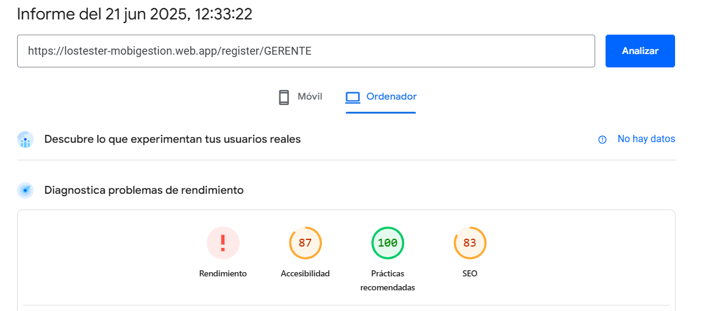
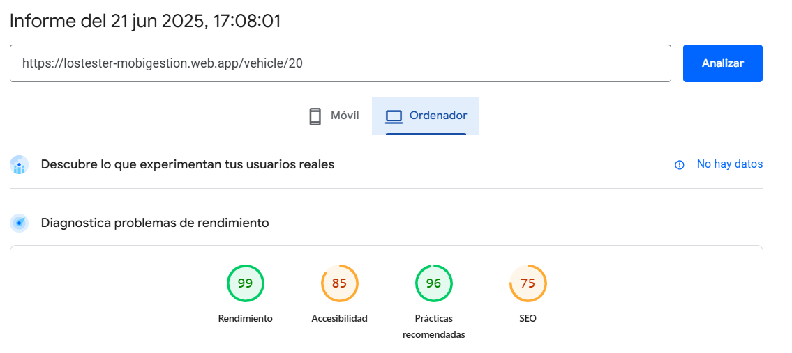

## 8.1. Experiment Planning

El Experiment Planning dentro del proceso XDPD es la etapa en la que se definen, priorizan y estructuran los experimentos que permitirán validar hipótesis sobre las posibles mejoras del producto. En esta fase, se transforma el diagnóstico previo (As‑Is Summary) en acciones concretas, estableciendo objetivos claros, métricas de éxito, hipótesis a probar y condiciones de validación para cada experimento. Esto garantiza que las decisiones de diseño y desarrollo estén guiadas por evidencia, y que los recursos se enfoquen en resolver los puntos críticos que más impacto generan en la experiencia del usuario o el valor del negocio.

### 8.1.1. As-Is Summary

El As‑Is Summary en el proceso XDPD es un diagnóstico conciso del estado actual de la solución, que combina datos técnicos (como métricas de rendimiento y accesibilidad), información cualitativa procedente de usuarios piloto y una identificación clara de las principales fricciones en la experiencia y la funcionalidad. Este resumen actúa como línea base para comprender con precisión cómo funciona hoy la plataforma, qué barreras enfrentan los usuarios y qué deficiencias técnicas o de escala existen, de modo que cada experimento posterior se diseñe sobre una realidad consolidada y orientada a resolver los problemas más críticos.

La plataforma MoviGestión, en su fase inicial de desarrollo, integra un conjunto de módulos fundamentales para optimizar la administración de flotas de transporte: registro y edición detallada de vehículos; asignación, filtrado y visualización de envíos; seguimiento en tiempo real del estado de cada entrega; reporte estructurado de incidencias; y consulta histórica de todas las operaciones realizadas. Actualmente solo está en prueba interna, con la participación de seis usuarios piloto (tres gerentes empresariales y tres transportistas), cuyas entrevistas han aportado información valiosa sobre la claridad de la interfaz, funcionalidades demandadas y principales puntos de fricción en el flujo de trabajo.

**Problemas encontrados**

- **Rendimiento técnico insuficiente**

  - El Largest Contentful Paint (LCP) promedia 5,0 s en pantallas críticas (por ejemplo, el dashboard y la lista de envíos), lo que crea una percepción de lentitud y puede desincentivar la interacción continua.   

  - El First Contentful Paint (FCP) alcanza 2,5 s, por encima del rango recomendado de 1 – 1,5 s para brindar una experiencia percibida como ágil y receptiva.  

  - Accesibilidad promedio de 87/100 y SEO promedio de 75/100 en Lighthouse, lo que señala oportunidades de mejora en contraste, estructura semántica y metaetiquetado.  

- **Usabilidad insuficiente**

  - La ausencia de tutoriales interactivos y coach‑marks impide que los nuevos usuarios se familiaricen rápidamente con la interfaz y perciban un progreso inmediato durante la carga de datos.  

  - Falta de modo oscuro y esquemas de alto contraste que garanticen comodidad en entornos con poca luz y cumplan con WCAG AAA.  

- **Falta de posibles funcionalidades esenciales**

  - Falta un sistema de notificaciones multicanal (push, email y SMS) que los usuarios puedan configurar para recibir alertas sobre incidencias, asignaciones y cambios de estado en tiempo real.  

  - No se ha implementado un módulo de optimización de rutas dinámico, capaz de calcular trayectos óptimos según tráfico, disponibilidad de vehículos y ventanas horarias.  

  - La plataforma carece de herramientas para exportar datos y generar reportes descargables (PDF y Excel) con plantillas personalizables, lo que dificulta la elaboración de informes periódicos.  

- **Mantenimiento y escalabilidad**

  - No existe un sistema centralizado de logging o monitoreo de errores en tiempo real que detecte y alerte sobre fallos antes de que afecten a un mayor número de usuarios.  

  - La arquitectura actual, de carácter más monolítico, no está preparada para escalar horizontalmente, lo cual podría comprometer la estabilidad a medida que crezca la base de usuarios y el volumen de datos procesados.  

- **Falta de internacionalización y traducciones**

  - Toda la interfaz y los contenidos están únicamente en español: no hay soporte para formatos internacionales (fecha, moneda, zona horaria) ni traducciones disponibles, lo que limita la adopción por hablantes de otros idiomas y obstaculiza la expansión regional.  

**Objetivos de mejora**

1. **Optimización de rendimiento**

   - Reducir First Contentful Paint a < 1,5 s y Largest Contentful Paint a < 2 s en vistas clave (dashboard, lista de envíos) mediante mejoras en el rendering, división inteligente de espacios, cards y lists, y compresión avanzada de recursos.  

2. **Accesibilidad y personalización UI**

   - Introducir un modo oscuro y esquemas de alto contraste, cumpliendo con el nivel AAA de las WCAG.  

   - Ajustar tipografías, espaciados y tamaños de elemento para maximizar la legibilidad en todo tipo de dispositivos y entornos de iluminación.  

3. **Onboarding y soporte contextual**

   - Desarrollar tutoriales interactivos y coach‑marks que guíen al usuario en los flujos esenciales durante su primera sesión.  

   - Integrar un widget de ayuda contextual o chat en vivo para resolver dudas y reducir la dependencia de documentación externa.  

4. **Notificaciones multicanal configurables**

   - Desplegar alertas push, email y SMS para incidencias, confirmaciones de entrega y cambios de asignación.  

   - Permitir a cada usuario definir el canal preferido y la frecuencia de recepción de avisos, mejorando la relevancia de las notificaciones.  

5. **Optimización de rutas en tiempo real**

   - Añadir un motor de cálculo dinámico de rutas que considere tráfico en vivo, capacidad del vehículo y ventanas horarias, ofreciendo itinerarios óptimos y flexibles.  

6. **Exportación avanzada de datos**

   - Ofrecer generación y descarga de reportes en formatos PDF y Excel, con plantillas personalizables que incluyan métricas de rendimiento, entregas e incidencias.  

   - Proporcionar una interfaz para definir periodos y filtros, facilitando la obtención de informes periódicos.  

7. **Monitorización y escalado automático**

   - Implementar un sistema de registro centralizado de errores y métricas de rendimiento, con alertas en tiempo real.  

   - Migrar gradualmente a una arquitectura de contenedores o una arquitectura en la nube para soportar picos de carga y crecimiento continuo.  

8. **Internacionalización completa**

   - Añadir soporte para formatos internacionales (fechas, moneda, zonas horarias) y traducir toda la interfaz al inglés.  

   - Garantizar que la documentación, tutoriales y mensajes de error estén disponibles en más de un idioma.  

9. **Medición continua y feedback**

   - Instrumentar encuestas breves in‑app tras eventos clave (por ejemplo el cierre de una entrega por un transportista) para recopilar opiniones cualitativas.  

   - Definir, monitorizar y comunicar KPIs de adopción y satisfacción, como la tasa de retención, número de tareas completadas por sesión y NPS interno.

### 8.1.2. Raw Material: Assumptions, Knowledge Gaps, Ideas, Claims

**Assumptions:**

- **Rendimiento excepcional como diferenciador:**
  Creemos que reducir el First Contentful Paint por debajo de 1,5 s y el Largest Contentful Paint por debajo de 2 s no solo aliviará la percepción de lentitud, sino que también aumentará la adopción diaria y la retención de usuarios en al menos un 15 %, alineándose con los estándares de las aplicaciones más competitivas.   

- **Control total de notificaciones:**
  Asumimos que permitir a cada usuario configurar canales (push, email y SMS) y la frecuencia de las alertas incrementará drásticamente la velocidad de respuesta ante incidencias críticas, mejorando la coordinación entre gerentes y transportistas.  

- **Adaptabilidad de la interfaz:**
  Creemos que ofrecer un modo claro/oscuro y esquemas de alto contraste (cumpliendo WCAG AAA) prolongará el tiempo de uso en entornos de iluminación adversa y reducirá la fatiga visual, incrementando la satisfacción del usuario.  

- **Optimización de rutas como ventaja competitiva:**
  Suponemos que un motor de planificación de rutas dinámico, que integre datos de tráfico en tiempo real y capacidad de vehículo, puede reducir los kilómetros recorridos y el gasto de combustible entre un 10 % y un 20 %.  

- **Valor del reporting con documentos impresos:**
  Consideramos que la capacidad de exportar datos en PDF y Excel con plantillas configurables ahorrará al menos un 40 % del tiempo dedicado a la elaboración de informes periódicos, liberando recursos para el análisis estratégico.  

- **Visibilidad proactiva de errores:**
  Damos por hecho que implementar un sistema de logging y monitoreo en tiempo real reducirá significativamente el tiempo medio de resolución de incidencias y evitará que los problemas se propaguen, manteniendo la confianza del usuario.  

- **Internacionalización como motor de crecimiento:**
  Asumimos que soportar formatos globales (fechas, monedas, zonas horarias) y traducir la interfaz al inglés permitirá captar nuevos mercados y ampliar la base de usuarios potenciales en un 20 % o más.  

- **Feedback continuo e iterativo**
  Creemos que desplegar encuestas breves in‑app tras eventos críticos (por ejemplo, cierre de una entrega) generará insights cualitativos y cuantitativos que impulsen mejoras, elevando el NPS interno en al menos un 10 %.  

**Knowledge Gaps:**

- **Tolerancia a la latencia:**
  Desconocemos el punto de ruptura de la experiencia en el que los usuarios abandonan la plataforma, ya sea por un Largest Contentful Paint demasiado largo, por errores constantes u otros factores de alto impacto en la usabilidad y experiencia.   

- **Preferencias de notificación:**
  No disponemos de datos sobre qué tipo de canal (push, email o SMS) prefieren los gerentes y transportistas para recibir distintos avisos, ni en qué circunstancias un medio resulta más efectivo que otro. Sabemos que todos son usados, pero no sabemos cual es el preferido o más usado.  

- **\*Interés en internacionalización:**
  Carecemos de información cuantitativa sobre el apetito real por cambiar de idioma a inglés, así como sobre la importancia de soportar formatos de fecha, moneda y zona horaria en mercados clave.  

- **Formatos de reporte y filtros:**
  Carecemos de información sobre qué combinaciones de datos (fechas, transportistas, estados de envío) y qué tipos de plantillas (gráficos, tablas, resúmenes ejecutivos) resultan más útiles para cada perfil de usuario al generar informes periódicos.  

- **Canal de soporte preferido:**
  Falta información sobre si los usuarios prefieren un chat en vivo integrado, un widget de preguntas frecuentes o documentación contextual, y cómo esto influye en la resolución de dudas y en la satisfacción general.  

- **Comportamiento cross-device real:**
  Carecemos de métricas segmentadas que muestren diferencias en patrones de uso entre móvil y escritorio, especialmente en entornos de red limitada, para priorizar optimizaciones responsivas.  

- **Curva de adopción y abandono:**
  No tenemos datos sobre en qué paso exacto del onboarding (registro, primer filtrado, primer reporte) los usuarios tienden a abandonar, ni sobre las razones cualitativas detrás de ese abandono.

**Ideas:**

- **Pruebas A/B de percepción de velocidad:**
  Comparar dos versiones de las pantallas críticas de la aplicación con variaciones y ediciones distintas, esto para medir cómo varía la satisfacción del usuario y el tiempo hasta la primera interacción perceptible.   

- **Encuestas in‑app dirigidas y segmentadas:**
  Implementar formularios breves en contextos clave (por ejemplo, al cerrar una entrega o al visualizar un reporte) que pregunten a gerentes y transportistas sobre sus preferencias de notificación, uso de reportes y valor percibido de nuevas funciones.  

- **Prototipado rápido de modo oscuro y alto contraste:**
  Desarrollar un “theme switcher” mínimo capaz de alternar entre modo claro/oscuro y alto contraste, y organizar sesiones de prueba con usuarios piloto para recoger feedback sobre usabilidad, legibilidad y preferencia de esquema.  

- **Panel MVP (Producto Mínimo Viable) de exportación de datos:**
  Diseñar una interfaz sencilla donde los usuarios puedan seleccionar métricas, rangos de fechas y formatos (PDF/Excel) para descargar reportes, con capacidad de previsualizar la plantilla y validar la utilidad de los distintos layouts.  

- **Prototipo de onboarding guiado:**
  Desarrollar una capa de tutorial interactivo con coach‑marks y pasos secuenciales que acompañen al usuario en su primera sesión, midiendo la reducción de la tasa de abandono en cada paso del flujo de registro y configuración inicial.

**Claims:**

- **Percepción de rendimiento mejorada:**
  Se sostiene que reducir el Largest Contentful Paint por debajo de 2 s no solo disminuirá la frustración inicial del usuario, sino que incrementará la satisfacción global y la retención de la plataforma en al menos un 15 %, acercando la experiencia a los estándares de aplicaciones de alto rendimiento.   

- **Respuesta más ágil ante incidencias:**
  Se postula que la implementación de notificaciones multicanal configurables (push, email y SMS) permitirá a gerentes y transportistas reaccionar un 30 % más rápido ante reportes críticos, mejorando la coordinación operacional y reduciendo el tiempo de interrupción de los flujos de trabajo.  

- **Reducción de costes logísticos:**
  Se afirma que incorporar un motor de optimización de rutas dinámico, basado en datos de tráfico en tiempo real y capacidades de vehículo, puede reducir el kilometraje y el consumo de combustible en un 10 %–20 %, traduciéndose en ahorros significativos para las empresas.  

- **Mayor adopción en entornos oscuros:**
  Se plantea que la introducción de un tema oscuro y esquemas de alto contraste elevará el uso diario de la aplicación en condiciones de baja iluminación en un 25 %, al mejorar la legibilidad y reducir la fatiga visual durante jornadas prolongadas.  

- **Eficiencia en la elaboración de informes:**
  Se asume que la capacidad de exportar datos en formatos PDF y Excel con plantillas personalizables reducirá hasta en un 40 % el tiempo dedicado a generar reportes periódicos, liberando recursos para el análisis estratégico y la toma de decisiones.  

- **Incremento del feedback accionable:**
  Se sostiene que la implementación de encuestas breves in‑app tras eventos críticos (por ejemplo, la finalización de una entrega) generará un aumento del 20 % en la tasa de respuesta de usuarios, proporcionando datos cualitativos y cuantitativos que orienten mejoras continuas en la plataforma.

### 8.1.3. Experiment-Ready Questions

En esta sección presentamos las Experiment‑Ready Questions, un conjunto de preguntas concretas y priorizadas que guían la validación de nuestras principales hipótesis de mejora. Cada pregunta está diseñada para enfocarse en un aspecto crítico identificado en el As‑Is y el Raw Material, desde la percepción de rendimiento hasta la adopción de nuevas funcionalidades, evaluando de manera cuantitativa el impacto, el riesgo de implementación y el grado de interés de los usuarios. Al responderlas mediante pequeños experimentos controlados, podremos tomar decisiones fundamentadas, optimizar recursos y avanzar en ciclos iterativos que impulsen la evolución de MoviGestión de forma ágil y eficiente.

| Question                                                                                                        | Confidence                                                                                            | Risk                                                                                 | Impact                                                                              | Interest                                                                               | Total Score |
| --------------------------------------------------------------------------------------------------------------- | ----------------------------------------------------------------------------------------------------- | ------------------------------------------------------------------------------------ | ----------------------------------------------------------------------------------- | -------------------------------------------------------------------------------------- | ----------- |
| ¿Mejorará la percepción de velocidad el uso de skeleton screens en pantallas críticas frente al loader clásico? | 8 – Técnica probada en la industria para reducir la percepción de espera.                             | 2 – Riesgo bajo, es una modificación visual ligera.                                  | 6 – Puede aumentar el engagement y reducir el abandono inicial.                     | 5 – Interés moderado, los usuarios notan mejoras sutiles de UX.                        | 21          |
| ¿Reducirá el tiempo de respuesta a incidencias la implementación de notificaciones multicanal configurables?    | 8 – Buena base en otros sistemas de alertas multicanal.                                               | 3 – Riesgo medio-bajo, implica configuración de infraestructura de mensajería.       | 8 – Mejora significativa de la coordinación operativa y la resolución de problemas. | 7 – Alta relevancia para gerentes y transportistas que dependen de alertas inmediatas. | 26          |
| ¿Disminuirán los costes logísticos y kilómetros recorridos la optimización dinámica de rutas en tiempo real?    | 6 – Supuesto fundamentado en estudios de tráfico y planificación logística.                           | 6 – Riesgo moderado-alto, el desarrollo es complejo y dependiente de datos externos. | 9 – Potencial muy alto de ahorro de combustible y mejora de eficiencia operativa.   | 8 – Gran interés, ya que impacta directamente en costes de la operación.               | 29          |
| ¿Ahorrará tiempo administrativo la función de exportación de datos a PDF/Excel con plantillas configurables?    | 7 – Basado en experiencias de herramientas BI (Business Intelligence) y ERP (Recursos empresariales). | 3 – Riesgo bajo, funcionalidad relativamente sencilla de implementar.                | 8 – Reduce carga de trabajo manual y agiliza la generación de informes periódicos.  | 6 – Interés moderado, especialmente en perfiles gerenciales y administrativos.         | 24          |
| ¿Reducirá la tasa de abandono en el onboarding la introducción de tutoriales interactivos y coach‑marks?        | 8 – Alta confianza, técnicas de onboarding interactivo ampliamente adoptadas.                         | 5 – Riesgo medio, requiere diseño cuidadoso de flujos y contenido.                   | 8 – Impacto directo en la adopción y en la curva de aprendizaje de nuevos usuarios. | 7 – Fuerte interés, los usuarios valoran la guía en sus primeros pasos.                | 28          |
| ¿Aumentará el uso en entornos de baja iluminación la implementación de un modo oscuro y alto contraste?         | 8 – Funcionalidad popular y de bajo esfuerzo técnico.                                                 | 2 – Riesgo bajo, es un cambio de estilos y temas.                                    | 6 – Mejora la comodidad visual, aunque no es crítica para todos los usuarios.       | 6 – Interés moderado, especialmente en usuarios con largos periodos de uso nocturno.   | 22          |
| ¿Incrementará la base de usuarios activos la internacionalización al inglés?                                    | 5 – Depende de la demanda real en mercados extranjeros.                                               | 5 – Riesgo medio, implica proceso de traducción y adaptación cultural.               | 8 – Puede abrir nuevas oportunidades de mercado y crecimiento de la audiencia.      | 6 – Interés variable según perfil de usuario y región.                                 | 24          |

### 8.1.4. Question Backlog

| Prioridad (1,2,3,5,8,) | Pregunta                                                                                                        |
| ---------------------- | --------------------------------------------------------------------------------------------------------------- |
| 5                      | ¿Reducirá la tasa de abandono en el onboarding la introducción de tutoriales interactivos y coach-marks?        |
| 5                      | ¿Reducirá el tiempo de respuesta a incidencias la implementación de notificaciones multicanal configurables?    |
| 3                      | ¿Incrementará la base de usuarios activos la internacionalización al inglés?                                    |
| 3                      | ¿Aumentará el uso en entornos de baja iluminación la implementación de un modo oscuro y alto contraste?         |
| 1                      | ¿Mejorará la percepción de velocidad el uso de skeleton screens en pantallas críticas frente al loader clásico? |

### 8.1.5. Experiment Cards

| Question   | ¿Reducirá el tiempo de respuesta a incidencias la implementación de notificaciones multicanal configurables?                                                                                                                                                                                                        |
| ---------- | ------------------------------------------------------------------------------------------------------------------------------------------------------------------------------------------------------------------------------------------------------------------------------------------------------------------- |
| Why        | Actualmente no existe un sistema de notificaciones multicanal (push, email y SMS) que los usuarios puedan configurar. Se postula que las notificaciones multicanal configurables permitirán a gerentes y transportistas reaccionar un 30% más rápido ante reportes críticos, mejorando la coordinación operacional. |
| What       | Desplegar alertas push, email y SMS para incidencias, confirmaciones de entrega y cambios de asignación. Permitir a cada usuario definir el canal preferido y la frecuencia de recepción de avisos.                                                                                                                 |
| Hypothesis | Se espera que, con la implementación de notificaciones multicanal configurables, el tiempo promedio de respuesta a incidencias críticas por parte de gerentes y transportistas se reduzca en un 30% o más.                                                                                                          |

| Question   | ¿Reducirá la tasa de abandono en el onboarding la introducción de tutoriales interactivos y coach‑marks?                                                                                                                                                                                                                                                      |
| ---------- | ------------------------------------------------------------------------------------------------------------------------------------------------------------------------------------------------------------------------------------------------------------------------------------------------------------------------------------------------------------- |
| Why        | La ausencia de tutoriales interactivos y coach-marks impide que los nuevos usuarios se familiaricen rápidamente con la interfaz y perciban un progreso inmediato durante la carga de datos. Se tiene alta confianza en que estas técnicas de onboarding interactivo reducirán la tasa de abandono en cada paso del flujo de registro y configuración inicial. |
| What       | Desarrollar tutoriales interactivos y coach-marks que guíen al usuario en los flujos esenciales durante su primera sesión.                                                                                                                                                                                                                                    |
| Hypothesis | Se espera que la introducción de tutoriales interactivos y coach-marks reduzca la tasa de abandono de nuevos usuarios en al menos un 15% durante el proceso de onboarding inicial.                                                                                                                                                                            |

| Question   | ¿Mejorará la percepción de velocidad el uso de skeleton screens en pantallas críticas frente al loader clásico?                                                                                                                                                                                                                     |
| ---------- | ----------------------------------------------------------------------------------------------------------------------------------------------------------------------------------------------------------------------------------------------------------------------------------------------------------------------------------- |
| Why        | El Largest Contentful Paint (LCP) promedia 5,0s y el First Contentful Paint (FCP) alcanza 2,5s en pantallas críticas, creando una percepción de lentitud. Se cree que reducir el LCP a < 2s y el FCP a < 1,5s no solo aliviará la percepción de lentitud, sino que también aumentará la adopción diaria y la retención de usuarios. |
| What       | Comparar dos versiones de las pantallas críticas de la aplicación (con skeleton screens vs. loader clásico) para medir cómo varía la satisfacción del usuario y el tiempo hasta la primera interacción perceptible.                                                                                                                 |
| Hypothesis | Se espera que el uso de skeleton screens en pantallas críticas reduzca la percepción de lentitud, mejorando la satisfacción del usuario y potencialmente aumentando el engagement y reduciendo el abandono inicial.                                                                                                                 |

| Question   | ¿Incrementará la base de usuarios activos la internacionalización al inglés?                                                                                                                                                                                                                                                      |
| ---------- | --------------------------------------------------------------------------------------------------------------------------------------------------------------------------------------------------------------------------------------------------------------------------------------------------------------------------------- |
| Why        | Toda la interfaz y los contenidos están únicamente en español, lo que limita la adopción por hablantes de otros idiomas y obstaculiza la expansión regional. Se asume que soportar formatos globales y traducir la interfaz al inglés permitirá captar nuevos mercados y ampliar la base de usuarios potenciales en un 20% o más. |
| What       | Añadir soporte para formatos internacionales (fechas, moneda, zonas horarias) y traducir toda la interfaz al inglés.                                                                                                                                                                                                              |
| Hypothesis | Se espera que la internacionalización de la interfaz al inglés incremente la base de usuarios activos en al menos un 20% al permitir la adopción en nuevos mercados.                                                                                                                                                              |

| Question   | ¿Mejorará la experiencia añadiendo un modo oscuro a la aplicación web?                                                                                                                                                                                                                                                                            |
| ---------- | ------------------------------------------------------------------------------------------------------------------------------------------------------------------------------------------------------------------------------------------------------------------------------------------------------------------------------------------------- |
| Why        | Al agregar un modo oscuro, se mejora la usabilidad para los usuarios que prefieren una experiencia visual más cómoda, especialmente en ambientes con poca luz. Esto no solo reduce la fatiga visual, sino que también puede aumentar el tiempo que los usuarios pasan en la aplicación, resultando en un mayor compromiso y satisfacción general. |
| What       | Implementar un modo oscuro que los usuarios puedan seleccionar fácilmente en la configuración de la aplicación. Esto incluiría ajustar el esquema de colores de texto, fondo y elementos gráficos para facilitar una experiencia de navegación más cómoda.                                                                                        |
| Hypothesis | Se espera que, al añadir el modo oscuro, el 60% de los usuarios informen una mejora en la usabilidad y que el tiempo promedio de uso de la aplicación se incremente en un 25%.                                                                                                                                                                    |

## 8.2. Experiment Design

### 8.2.1. Hypotheses

|                     | **Hypothesis**                                                                                                                                 |
| ------------------- | ---------------------------------------------------------------------------------------------------------------------------------------------- |
| **Question**        | ¿Reducirá el tiempo de respuesta a incidencias la implementación de notificaciones multicanal configurables?                                   |
| **Belief**          | La configuración de notificaciones multicanal permitirá una mejor coordinación y una respuesta más rápida a incidencias críticas.              |
| **Hypothesis**      | La implementación de notificaciones multicanal configurables reducirá el tiempo promedio de respuesta a incidencias en al menos un 30%.        |
| **Null Hypothesis** | La implementación de notificaciones multicanal configurables no tendrá impacto significativo en el tiempo promedio de respuesta a incidencias. |

|                     | **Hypothesis**                                                                                                                                                           |
| ------------------- | ------------------------------------------------------------------------------------------------------------------------------------------------------------------------ |
| **Question**        | ¿Reducirá la tasa de abandono en el onboarding la introducción de tutoriales interactivos y coach‑marks?                                                                 |
| **Belief**          | Los tutoriales interactivos y coach‑marks ayudarán a nuevos usuarios a comprender mejor la interfaz y avanzar de manera más eficiente en su flujo inicial.               |
| **Hypothesis**      | La introducción de tutoriales interactivos y coach‑marks reducirá la tasa de abandono de nuevos usuarios en al menos un 15% durante el proceso de onboarding inicial.    |
| **Null Hypothesis** | La introducción de tutoriales interactivos y coach‑marks no reducirá significativamente la tasa de abandono de nuevos usuarios durante el proceso de onboarding inicial. |

|                     | **Hypothesis**                                                                                                                                          |
| ------------------- | ------------------------------------------------------------------------------------------------------------------------------------------------------- |
| **Question**        | ¿Mejorará la percepción de velocidad el uso de skeleton screens en pantallas críticas frente al loader clásico?                                         |
| **Belief**          | Los skeleton screens reducirán la percepción de lentitud y mejorarán la satisfacción de los usuarios durante la carga de pantallas críticas.            |
| **Hypothesis**      | El uso de skeleton screens en pantallas críticas reducirá la percepción de lentitud y aumentará la satisfacción de los usuarios en al menos un 10%.     |
| **Null Hypothesis** | El uso de skeleton screens en pantallas críticas no mejorará significativamente la percepción de lentitud ni aumentará la satisfacción de los usuarios. |

|                     | **Hypothesis**                                                                                                                                                        |
| ------------------- | --------------------------------------------------------------------------------------------------------------------------------------------------------------------- |
| **Question**        | ¿Incrementará la base de usuarios activos la internacionalización al inglés?                                                                                          |
| **Belief**          | La internacionalización de la interfaz al inglés permitirá expandir la base de usuarios en mercados clave que prefieren este idioma.                                  |
| **Hypothesis**      | La internacionalización de la interfaz al inglés incrementará la base de usuarios activos en al menos un 20% dentro de seis meses posteriores a su implementación.    |
| **Null Hypothesis** | La internacionalización de la interfaz al inglés no incrementará significativamente la base de usuarios activos dentro de seis meses posteriores a su implementación. |

|                     | **Hypothesis**                                                                                                                                                               |
| ------------------- | ---------------------------------------------------------------------------------------------------------------------------------------------------------------------------- |
| **Question**        | ¿Mejorará la experiencia añadiendo un modo oscuro a la aplicación web?                                                                                                       |
| **Belief**          | Un modo oscuro facilitará la navegación en entornos con poca luz, mejorando la comodidad visual y el compromiso de los usuarios.                                             |
| **Hypothesis**      | La introducción de un modo oscuro a la aplicación incrementará el tiempo promedio de uso en un 25% y aumentará la satisfacción percibida de al menos el 60% de los usuarios. |
| **Null Hypothesis** | La introducción de un modo oscuro no incrementará significativamente el tiempo promedio de uso ni mejorará significativamente la satisfacción percibida de los usuarios.     |

### 8.2.2. Measures

### Question: ¿Reducirá el tiempo de respuesta a incidencias la implementación de notificaciones multicanal configurables?

| Measure                                                                                                                                                                                                                                                                                                                                                                                                                                                                                                                                                              |
| -------------------------------------------------------------------------------------------------------------------------------------------------------------------------------------------------------------------------------------------------------------------------------------------------------------------------------------------------------------------------------------------------------------------------------------------------------------------------------------------------------------------------------------------------------------------- |
| **Tiempo promedio de respuesta:** Registrar el tiempo promedio que transcurre desde que ocurre una incidencia hasta que se toma la primera acción correctiva antes y después de la implementación.   **Satisfacción del usuario:** Realizar encuestas y entrevistas a gerentes y transportistas para evaluar la percepción de mejora en la coordinación y rapidez de notificaciones.   **Canal preferido:** Monitorear las configuraciones de usuarios para identificar qué canales (push, email, SMS) son los más usados y cómo contribuyen a la efectividad. |

---

### Question: ¿Reducirá la tasa de abandono en el onboarding la introducción de tutoriales interactivos y coach-marks?

| Measure                                                                                                                                                                                                                                                                                                                                                                                                                                                  |
| -------------------------------------------------------------------------------------------------------------------------------------------------------------------------------------------------------------------------------------------------------------------------------------------------------------------------------------------------------------------------------------------------------------------------------------------------------- |
| **Tasa de finalización del onboarding:** Comparar la cantidad de usuarios que completan el proceso antes y después de implementar los tutoriales interactivos.   **Tiempo promedio por paso:** Medir el tiempo promedio dedicado en cada etapa del onboarding y detectar posibles fricciones.   **Percepción del usuario:** Recopilar feedback directo mediante encuestas rápidas que midan la claridad, utilidad y satisfacción del flujo guiado. |

---

### Question: ¿Mejorará la percepción de velocidad el uso de skeleton screens en pantallas críticas frente al loader clásico?

| Measure                                                                                                                                                                                                                                                                                                                                                                                                                                                                                                |
| ------------------------------------------------------------------------------------------------------------------------------------------------------------------------------------------------------------------------------------------------------------------------------------------------------------------------------------------------------------------------------------------------------------------------------------------------------------------------------------------------------ |
| **Percepción de velocidad:** Evaluar, mediante encuestas, la experiencia de los usuarios con skeleton screens versus el loader clásico en términos de fluidez y percepción de espera.   **Métricas técnicas clave:** Analizar métricas como el Largest Contentful Paint (LCP) y el First Contentful Paint (FCP) para determinar mejoras cuantitativas.   **Engagement en pantallas clave:** Monitorear la interacción del usuario (clics, scrolls) en pantallas críticas después de los cambios. |

---

### Question: ¿Incrementará la base de usuarios activos la internacionalización al inglés?

| Measure                                                                                                                                                                                                                                                                                                                                                                                                                                                                             |
| ----------------------------------------------------------------------------------------------------------------------------------------------------------------------------------------------------------------------------------------------------------------------------------------------------------------------------------------------------------------------------------------------------------------------------------------------------------------------------------- |
| **Nuevas regiones activas:** Comparar el número de usuarios registrados y activos provenientes de mercados angloparlantes antes y después de implementar la internacionalización.   **Engagement regional:** Analizar métricas de interacción (sesiones, tiempo promedio de uso) segmentadas por región para medir la adopción.   **Comentarios culturales:** Realizar encuestas cualitativas y análisis de soporte para identificar posibles ajustes culturales o de idioma. |

---

### Question: ¿Mejorará la experiencia añadiendo un modo oscuro a la aplicación web?

| Measure                                                                                                                                                                                                                                                                                                                                                                                                                                                                                         |
| ----------------------------------------------------------------------------------------------------------------------------------------------------------------------------------------------------------------------------------------------------------------------------------------------------------------------------------------------------------------------------------------------------------------------------------------------------------------------------------------------- |
| **Uso del modo oscuro:** Monitorear qué porcentaje de usuarios activa el modo oscuro y su frecuencia de uso en comparación con el modo claro.   **Satisfacción visual:** Evaluar mediante encuestas la percepción de mejora en la comodidad visual, especialmente en entornos con poca luz.   **Incremento de tiempo de uso:** Comparar el tiempo promedio que los usuarios pasan en la plataforma antes y después de la implementación del modo oscuro para medir impacto en engagement. |

### 8.2.3. Conditions

### Question: ¿Reducirá el tiempo de respuesta a incidencias la implementación de notificaciones multicanal configurables?

| Condición Experimental                                                                                                                                                                                                                                                                                                        | Condición de Control                                                                                                                                                                 |
| ----------------------------------------------------------------------------------------------------------------------------------------------------------------------------------------------------------------------------------------------------------------------------------------------------------------------------- | ------------------------------------------------------------------------------------------------------------------------------------------------------------------------------------ |
| Implementación de un sistema de notificaciones multicanal (push, email, SMS) configurables, permitiendo a los usuarios seleccionar canales y frecuencia de alertas. El tiempo de respuesta a incidencias críticas disminuirá en un 30%, medido a través de tiempos promedio registrados antes y después de la implementación. | Uso del sistema actual sin notificaciones configurables ni opciones multicanal. Los reportes permanecen internos en la aplicación, con una comunicación más lenta y menos eficiente. |

---

### Question: ¿Reducirá la tasa de abandono en el onboarding la introducción de tutoriales interactivos y coach-marks?

| Condición Experimental                                                                                                                                                                                                                                                                          | Condición de Control                                                                                                                                                       |
| ----------------------------------------------------------------------------------------------------------------------------------------------------------------------------------------------------------------------------------------------------------------------------------------------- | -------------------------------------------------------------------------------------------------------------------------------------------------------------------------- |
| Desarrollo de tutoriales interactivos y coach-marks que guían a los usuarios paso a paso durante su primera sesión, destacando funciones clave y facilitando la navegación. La tasa de abandono disminuirá en un 15%, evaluado mediante análisis de embudo en las etapas del flujo de registro. | Uso de la interfaz actual sin tutoriales ni guías interactivas, dejando que los usuarios exploren la plataforma por su cuenta, lo que aumenta la probabilidad de abandono. |

---

### Question: ¿Mejorará la percepción de velocidad el uso de skeleton screens en pantallas críticas frente al loader clásico?

| Condición Experimental                                                                                                                                                                                                                                                        | Condición de Control                                                                                                     |
| ----------------------------------------------------------------------------------------------------------------------------------------------------------------------------------------------------------------------------------------------------------------------------- | ------------------------------------------------------------------------------------------------------------------------ |
| Implementación de skeleton screens en pantallas críticas para mostrar placeholders dinámicos mientras se carga el contenido real. La percepción de velocidad aumentará en un 25%, evaluado mediante encuestas de usuarios y tiempos hasta la primera interacción perceptible. | Uso del loader clásico, que presenta un ícono animado genérico durante la carga, creando una mayor percepción de espera. |

---

### Question: ¿Incrementará la base de usuarios activos la internacionalización al inglés?

| Condición Experimental                                                                                                                                                                                                                                                        | Condición de Control                                                                                                                                                     |
| ----------------------------------------------------------------------------------------------------------------------------------------------------------------------------------------------------------------------------------------------------------------------------- | ------------------------------------------------------------------------------------------------------------------------------------------------------------------------ |
| Internacionalización de la plataforma al inglés, con soporte para formatos globales (fechas, moneda, zonas horarias) y documentación adaptada. La base de usuarios activos crecerá en un 20%, evaluado mediante registros y usuarios recurrentes en mercados internacionales. | Plataforma disponible únicamente en español, sin soporte para formatos internacionales ni opciones de idioma adicionales, limitando la adopción en mercados extranjeros. |

---

### Question: ¿Mejorará la experiencia añadiendo un modo oscuro a la aplicación web?

| Condición Experimental                                                                                                                                                                                     | Condición de Control                                                                                                                                               |
| ---------------------------------------------------------------------------------------------------------------------------------------------------------------------------------------------------------- | ------------------------------------------------------------------------------------------------------------------------------------------------------------------ |
| Adición de un modo oscuro en la aplicación, configurable desde las preferencias de usuario. La satisfacción aumentará en un 20%, medido mediante encuestas y puntajes de valoración de experiencia visual. | Uso exclusivo del modo claro actual, sin opciones de personalización de esquema de colores, lo que puede generar fatiga visual en condiciones de baja iluminación. |

### 8.2.4. Scale Calculations and Decisions

Para garantizar que los experimentos diseñados generen resultados confiables y estadísticamente significativos, es fundamental calcular el tamaño de muestra adecuado y tomar decisiones informadas sobre el alcance de cada prueba. En esta sección se definen los criterios que permitirán determinar cuántos usuarios deben participar en cada experimento, considerando variables como el nivel de confianza deseado, el margen de error aceptable y la variabilidad esperada en las métricas clave. Estos cálculos asegurarán que los resultados obtenidos no solo sean representativos, sino que también respalden decisiones estratégicas con base en evidencia sólida.

<table border="1" cellpadding="8" cellspacing="0">
  <thead>
    <tr>
      <th rowspan="2">Scale Calculation</th>
      <th rowspan="2">Decision</th>
      <th colspan="4">Factor</th>
    </tr>
    <tr>
      <th>Desfavorable</th>
      <th>Aceptable</th>
      <th>Ideal</th>
      <th>Excelente</th>
    </tr>
  </thead>
  <tbody>
    <tr>
      <td>Suponemos que al habilitar un modo oscuro en la plataforma web, la experiencia de los usuarios mejorará significativamente, con una reducción notable en la fatiga visual y un incremento en el tiempo promedio de uso. Consideraremos que esta hipótesis es válida si se registra al menos un 30 % de aumento en la satisfacción reportada por los usuarios.
      </td>
      <td>Incorporar un modo oscuro configurable que permita a los usuarios alternar fácilmente entre una interfaz clara y una oscura, brindando mayor confort visual según sus preferencias.
      </td>
      <td></td>
      <td style="text-align: center;">X</td>
      <td></td>
      <td></td>
    </tr>
    <tr>
      <td>Consideramos que las notificaciones multicanal permitirán reducir el tiempo de respuesta ante incidencias en un 30%. Esto se validará si los tiempos promedios de atención disminuyen tras la implementación.</td>
      <td>Configurar alertas push, email y SMS para permitir a cada usuario elegir canal y frecuencia de notificación.</td>
      <td></td>
      <td></td>
      <td style="text-align: center;">X</td>
      <td></td>
    </tr>
    <tr>
      <td>Suponemos que la introducción de tutoriales interactivos y coach‑marks disminuirá la tasa de abandono durante el onboarding en al menos un 15%.</td>
      <td>Desarrollar tutoriales que guíen paso a paso a los nuevos usuarios en su primera sesión.</td>
      <td></td>
      <td style="text-align: center;">X</td>
      <td></td>
      <td></td>
    </tr>
    <tr>
      <td>Creemos que el uso de skeleton screens mejorará la percepción de velocidad de carga en pantallas críticas, aumentando en un 10% la satisfacción en esas vistas.</td>
      <td>Implementar skeleton screens en lugar de loaders tradicionales en vistas como dashboard y lista de envíos.</td>
      <td></td>
      <td></td>
      <td style="text-align: center;">X</td>
      <td></td>
    </tr>
    <tr>
      <td>Se espera que al internacionalizar la interfaz al inglés y soportar formatos globales, la base de usuarios activos crezca en un 20% en mercados extranjeros.</td>
      <td>Traducir la interfaz al inglés e incluir soporte para fechas, monedas y zonas horarias internacionales.</td>
      <td style="text-align: center;">X</td>
      <td></td>
      <td></td>
      <td></td>
    </tr>
    <tr>
      <td>Asumimos que permitir la exportación de datos en formatos PDF y Excel con plantillas configurables reducirá en un 40% el tiempo dedicado a generar reportes.</td>
      <td>Desarrollar una interfaz para elegir métricas, filtros y descargar reportes en formato editable.</td>
      <td></td>
      <td style="text-align: center;">X</td>
      <td></td>
      <td></td>
    </tr>
  </tbody>
</table>

### 8.2.5. Methods Selection

Para validar los experimentos definidos en el marco del desarrollo de MoviGestión, se seleccionaron herramientas complementarias que permiten observar y medir tanto el rendimiento técnico como el comportamiento y satisfacción del usuario. La elección se realizó en función del tipo de hipótesis planteadas (rendimiento, usabilidad, satisfacción, retención) y del nivel de profundidad y accesibilidad que cada herramienta ofrece. A continuación se presenta la selección justificada:

| **Herramienta**           | **Google Analytics**                                                                                                                                                                  | **Catchpoint**                                                                                                                                                                       | **RedLine13**                                                                                                                                         | **Lighthouse**                                                                                                                                  |
| ------------------------- | ------------------------------------------------------------------------------------------------------------------------------------------------------------------------------------- | ------------------------------------------------------------------------------------------------------------------------------------------------------------------------------------ | ----------------------------------------------------------------------------------------------------------------------------------------------------- | ----------------------------------------------------------------------------------------------------------------------------------------------- |
| **Uso en MoviGestión**    | Medición de métricas de comportamiento como tiempo de sesión, tasa de abandono y uso de funcionalidades clave. Ideal para validar hipótesis sobre retención, engagement y onboarding. | Evaluación de rendimiento en tiempo real desde múltiples ubicaciones y dispositivos. Útil para monitorear el sistema en contextos distribuidos y validar hipótesis de escalabilidad. | Ideal para pruebas de carga en endpoints críticos como exportación de datos o cálculo de rutas. Permite validar hipótesis de rendimiento bajo estrés. | Evaluación técnica de rendimiento (LCP, FCP), accesibilidad y buenas prácticas. Clave para validar mejoras como modo oscuro y skeleton screens. |
| **Capacidad de Análisis** | Análisis exhaustivo de métricas de uso e interacción del usuario.                                                                                                                     | Monitoreo detallado del rendimiento y experiencia desde distintos puntos globales.                                                                                                   | Pruebas de tráfico y estrés orientadas a evaluar estabilidad en condiciones de carga intensiva.                                                       | Métricas clave de rendimiento, accesibilidad y UX presentadas de forma clara para decisiones rápidas.                                           |
| **Sencillez**             | Interfaz intuitiva y aprendizaje rápido. Ideal para equipos de producto y análisis.                                                                                                   | Interfaz técnica avanzada. Requiere mayor familiaridad para interpretar correctamente los resultados.                                                                                | Información técnica precisa, aunque menos enfocada en visualización amigable.                                                                         | Presentación clara y directa de puntajes clave; requiere conocimientos básicos para interpretación.                                             |
| **Ventajas**              | Excelente capacidad de generación de reportes e integración con otras plataformas (Firebase, BigQuery, etc.).                                                                         | Análisis exhaustivo en tiempo real desde diversas ubicaciones, ideal para pruebas globales.                                                                                          | Simulación de carga útil para evaluar la resistencia del sistema ante múltiples usuarios simultáneos.                                                 | Diagnóstico completo sin costo, ideal para validar mejoras de rendimiento y accesibilidad localmente.                                           |

### 8.2.6. Data Analytics: Goals, KPIs and Metrics Selection

Para garantizar una evaluación rigurosa de los experimentos y tomar decisiones basadas en evidencia, se definieron objetivos analíticos claros, junto con KPIs e indicadores específicos por funcionalidad. Esta selección asegura el seguimiento continuo del impacto de cada mejora implementada en la experiencia del usuario y en la eficiencia operativa de MoviGestión.

**Gerente**

**Transportista**

**Estadísticas**

### 8.2.7. Web and Mobile Tracking Plan

Para **MoviGestión**, nuestro objetivo es optimizar y monitorear la aplicación web y móvil con el fin de mejorar la gestión de flotas, garantizar la eficiencia operativa y maximizar la satisfacción de los usuarios. A medida que implementamos mejoras clave, estableceremos un plan de seguimiento detallado que nos permita evaluar el impacto de las funcionalidades introducidas y garantizar el cumplimiento de los objetivos planteados.

El monitoreo de las funcionalidades experimentales se realizará en dos etapas principales:

#### 1. Implementación Inicial

Durante esta etapa, nos centraremos en el despliegue de las nuevas funcionalidades y en la recopilación de datos iniciales para establecer una línea base de rendimiento.

##### **Recopilación de Datos**

- **Métricas de Uso:**

  - Número de usuarios activos diarios y mensuales (DAU/MAU).
  - Duración promedio de las sesiones.
  - Tasa de uso de funcionalidades críticas, como la visualización de rutas, la carga de envíos y el registro de incidencias.

- **Interacciones de los Usuarios:**

  - Cantidad de clics en botones clave (e.g., "Optimizar Ruta", "Reportar Incidencia").
  - Frecuencia de acceso a vistas críticas como el dashboard y el historial de operaciones.

- **Feedback de Usuarios:**
  - Encuestas integradas en la aplicación para evaluar la percepción sobre la usabilidad de las nuevas funcionalidades, incluyendo tutoriales interactivos y configuraciones de notificaciones.

##### **Análisis Comparativo**

- Comparación entre las métricas obtenidas tras la implementación de las funcionalidades con los datos históricos de la plataforma.
- Identificación de cambios en el rendimiento técnico (e.g., First Contentful Paint, Largest Contentful Paint).

#### 2. Seguimiento Continuo

Después de la implementación inicial, se establecerá un sistema continuo de monitoreo y evaluación para realizar ajustes basados en datos y mejorar la experiencia del usuario.

##### **Recopilación de Datos**

- **Métricas en Tiempo Real:**

  - Uso de herramientas como Google Analytics y Firebase para rastrear el comportamiento del usuario en tiempo real.
  - Identificación de tendencias de uso, como los horarios pico de actividad y las funcionalidades más utilizadas.

- **Segmentación de Usuarios:**

  - Separación de datos por tipo de usuario (gerentes, transportistas, administradores).
  - Análisis de patrones de interacción específicos de cada grupo para personalizar mejoras.

- **Tasa de Retención:**
  - Seguimiento de usuarios recurrentes mensuales (MRR).
  - Evaluación de la tasa de abandono en etapas clave como el onboarding o el registro de vehículos.

##### **Evaluación y Ajustes**

- **Informes Periódicos:**

  - Generación de informes mensuales que incluyan datos clave, análisis de tendencias y recomendaciones para optimización.
  - Identificación de oportunidades para iterar en las funcionalidades implementadas.

- **Iteración Basada en Datos:**
  - Ajustes en tiempo real en la interfaz de usuario, notificaciones y optimización de rutas con base en los datos recopilados y el feedback de usuarios.
  - Priorización de futuras actualizaciones y mejoras basadas en las métricas de impacto.

Este enfoque asegurará que **MoviGestión** evolucione continuamente en función de los datos, maximizando su utilidad para los usuarios y consolidándose como una herramienta esencial en la gestión de flotas de transporte.

# 8.3. Experimentation

En esta fase se implementan y prueban soluciones concretas para validar las hipótesis definidas. A través de experimentos controlados se busca medir su impacto real en la experiencia del usuario y el valor del negocio, permitiendo tomar decisiones basadas en evidencia.

## 8.3.1. To-Be User Stories.

Las siguientes historias representan funcionalidades esperadas tras la experimentación. Están formuladas con escenarios claros que permiten evaluar su impacto en el comportamiento del usuario y validar si cumplen los objetivos definidos en los experimentos previos.

| **User Story ID** | **Título**                             | **Descripción**                                                                                                                                      | **Criterios de Aceptación**                                                                                                                                                                                                                                                                                                                                                | **Epic ID** |
| ----------------- | -------------------------------------- | ---------------------------------------------------------------------------------------------------------------------------------------------------- | -------------------------------------------------------------------------------------------------------------------------------------------------------------------------------------------------------------------------------------------------------------------------------------------------------------------------------------------------------------------------- | ----------- |
| UA01              | Activación de modo oscuro              | Como usuario frecuente de la plataforma, quiero activar un modo oscuro en la interfaz para reducir la fatiga visual en ambientes con poca luz.       | **Escenario 1: Activación manual desde configuración**  **Given** que estoy en configuración, **When** activo el modo oscuro, **Then** la interfaz cambia automáticamente.  **Escenario 2: Persistencia**  **Given** que lo activé previamente, **When** inicio sesión en otro dispositivo, **Then** la interfaz carga en modo oscuro.             | E06         |
| UA02              | Skeleton screens en pantallas clave    | Como usuario, quiero que se muestren skeleton screens al cargar listas y dashboards, para tener una percepción más fluida y rápida de la aplicación. | **Escenario 1: Visualización en carga**  **Given** que accedo al dashboard, **When** los datos están cargando, **Then** se muestra una animación de skeletons.  **Escenario 2: Reemplazo por datos reales**  **Given** que los datos están listos, **When** termina la carga, **Then** los skeletons desaparecen y se muestra la información real. | EP01        |
| UA03              | Encuestas tras entregas completadas    | Como transportista, quiero recibir una breve encuesta después de cada entrega completada para dar retroalimentación y mejorar la experiencia.        | **Escenario 1: Activación post-entrega**  **Given** que completo una entrega, **When** finalizo el proceso, **Then** se muestra una encuesta rápida.  **Escenario 2: Almacenamiento de respuestas**  **Given** que respondo la encuesta, **When** envío mis respuestas, **Then** estas se almacenan y son enviadas al sistema de analítica.        | EP05        |
| UA04              | Onboarding con pasos interactivos      | Como nuevo usuario, quiero un asistente que me guíe paso a paso en las funciones básicas para aprender rápidamente a usar la plataforma.             | **Escenario 1: Primer inicio**  **Given** que accedo por primera vez, **When** inicio sesión, **Then** se lanza un tutorial interactivo.                                                                                                                                                                                                                           | E06         |
| UA05              | Exportación de reportes personalizados | Como gerente, quiero exportar reportes en formatos PDF y Excel con filtros específicos para agilizar mis reuniones semanales.                        | **Escenario 1: Generación de reporte**  **Given** que accedo al módulo de reportes, **When** selecciono filtros y formato, **Then** el sistema genera el archivo.  **Escenario 2: Descarga**  **Given** que el reporte está generado, **When** presiono “descargar”, **Then** se descarga el archivo con el nombre y formato correcto.             | EP03        |
| UA06              | Cambio de idioma a inglés              | Como usuario, quiero cambiar el idioma de la interfaz a inglés para usar la aplicación en mi idioma preferido.                                       | **Escenario 1: Cambio desde configuración**  **Given** que estoy en configuración, **When** elijo inglés, **Then** toda la interfaz se actualiza al nuevo idioma.  **Escenario 2: Persistencia**  **Given** que cambio de idioma, **When** vuelvo a iniciar sesión, **Then** la configuración se mantiene.                                         | E06         |
| UA07              | Panel de estadísticas personales       | Como transportista, quiero ver estadísticas de mis entregas y reportes para evaluar mi desempeño y mejorar mi rendimiento.                           | **Escenario 1: Acceso al panel**  **Given** que inicio sesión, **When** accedo a “Mis estadísticas”, **Then** se muestra un resumen de mis entregas, fallos y reportes.  **Escenario 2: Filtros**  **Given** que elijo un período, **Then** los datos se actualizan.                                                                               | EP02        |

## 8.3.2. To-Be Product Backlog

El siguiente To-Be Product Backlog agrupa las historias de usuario propuestas en la fase de experimentación, priorizadas según su impacto y complejidad estimada. Cada ítem representa una funcionalidad clave a validar, alineada con hipótesis previamente definidas y con objetivos de mejora en rendimiento, usabilidad, personalización y expansión de la plataforma. Los Story Points asignados permiten estimar el esfuerzo de implementación y facilitar la planificación de futuros sprints.

| **# Orden** | **User Story ID** | **Título**                             | **Story Points** (1 / 2 / 3 / 5 / 8) |
| ----------- | ----------------- | -------------------------------------- | ------------------------------------ |
| 1           | UA01              | Activación de modo oscuro              | 2                                    |
| 2           | UA02              | Skeleton screens en pantallas clave    | 3                                    |
| 3           | UA03              | Encuestas tras entregas completadas    | 3                                    |
| 5           | UA04              | Onboarding con pasos interactivos      | 5                                    |
| 6           | UA05              | Exportación de reportes personalizados | 5                                    |
| 7           | UA06              | Cambio de idioma a inglés              | 3                                    |
| 8           | UA07              | Panel de estadísticas personales       | 3                                    |

## 8.3.3. Pipeline-supported, Experiment-Driven To-Be Software Platform Lifecycle

### 8.3.3.1. To-Be Sprint Backlogs

<table border="1" cellpadding="6" cellspacing="0">
  <thead>
    <tr>
      <td colspan="1"><strong>Sprint #</strong></td>
       <td colspan="8"><strong>Sprint 1</strong></td>
    </tr>
    <tr>
      <th colspan="2">User Story</th>
      <th colspan="6">WorkItem/Task</th>
    </tr>
    <tr>
      <th>Id</th>
      <th>Title</th>
      <th>Id</th>
      <th>Title</th>
      <th>Description</th>
      <th>Estimation (Story Points)</th>
      <th>Assigned To</th>
      <th>Status (To-do/In-Process/To-Review/Done)</th>
    </tr>
  </thead>
  <tbody>
    <tr>
      <td rowspan="2">UX01</td>
      <td rowspan="2">Activación de modo oscuro</td>
      <td>TK1</td>
      <td>Implementar cambio de tema manual</td>
      <td>Agregar opción de cambio claro/oscuro en ajustes del usuario</td>
      <td>1</td>
      <td>-----</td>
      <td>To-do</td>
    </tr>
    <tr>
      <td>TK2</td>
      <td>Persistencia del tema</td>
      <td>Guardar y aplicar la preferencia en futuras sesiones</td>
      <td>1</td>
      <td>-----</td>
      <td>To-do</td>
    </tr>
    <tr>
      <td rowspan="2">UX02</td>
      <td rowspan="2">Skeleton screens en pantallas clave</td>
      <td>TK3</td>
      <td>Implementar skeleton en dashboard</td>
      <td>Sustituir loader tradicional por skeleton mientras carga</td>
      <td>2</td>
      <td>-----</td>
      <td>To-do</td>
    </tr>
    <tr>
      <td>TK4</td>
      <td>Reemplazo por datos reales</td>
      <td>Detectar final de carga para mostrar información real</td>
      <td>1</td>
      <td>-----</td>
      <td>To-do</td>
    </tr>
    <tr>
      <td rowspan="2">UX03</td>
      <td rowspan="2">Encuestas tras entregas completadas</td>
      <td>TK5</td>
      <td>Mostrar encuesta tras entrega</td>
      <td>Desplegar formulario corto tras completar la entrega</td>
      <td>2</td>
      <td>-----</td>
      <td>In-Process</td>
    </tr>
    <tr>
      <td>TK6</td>
      <td>Almacenar respuestas</td>
      <td>Guardar respuestas y enviarlas a sistema analítico</td>
      <td>1</td>
      <td>-----</td>
      <td>To-do</td>
    </tr>
    <tr>
      <td rowspan="2">UA04</td>
      <td rowspan="2">Onboarding con pasos interactivos</td>
      <td>TK7</td>
      <td>Desplegar tutorial en primer inicio</td>
      <td>Detectar si es el primer inicio de sesión y lanzar el asistente paso a paso</td>
      <td>2</td>
      <td>-----</td>
      <td>To-do</td>
    </tr>
    <tr>
      <td>TK8</td>
      <td>Diseño visual del asistente</td>
      <td>Diseñar los pasos, tooltips y navegación del tutorial interactivo</td>
      <td>2</td>
      <td>-----</td>
      <td>To-do</td>
    </tr>
    <tr>
      <td rowspan="2">UA05</td>
      <td rowspan="2">Exportación de reportes personalizados</td>
      <td>TK9</td>
      <td>Generar reporte con filtros</td>
      <td>Permitir selección de filtros y formatos (PDF, Excel) en la vista de reportes</td>
      <td>2</td>
      <td>-----</td>
      <td>To-do</td>
    </tr>
    <tr>
      <td>TK10</td>
      <td>Descargar reporte generado</td>
      <td>Habilitar botón de descarga con el nombre y formato adecuado</td>
      <td>1</td>
      <td>-----</td>
      <td>To-do</td>
    </tr>
    <tr>
      <td rowspan="2">UA06</td>
      <td rowspan="2">Cambio de idioma a inglés</td>
      <td>TK11</td>
      <td>Selector de idioma</td>
      <td>Agregar selector de idioma en la configuración</td>
      <td>1</td>
      <td>-----</td>
      <td>To-do</td>
    </tr>
    <tr>
      <td>TK12</td>
      <td>Persistencia de idioma</td>
      <td>Guardar idioma preferido y mantenerlo entre sesiones</td>
      <td>2</td>
      <td>-----</td>
      <td>To-do</td>
    </tr>
    <tr>
      <td rowspan="2">UA07</td>
      <td rowspan="2">Panel de estadísticas personales</td>
      <td>TK13</td>
      <td>Acceso al panel de estadísticas</td>
      <td>Diseñar la vista de resumen con entregas, fallos y reportes al iniciar sesión</td>
      <td>3</td>
      <td>-----</td>
      <td>To-do</td>
    </tr>
    <tr>
      <td>TK14</td>
      <td>Aplicar filtros por período</td>
      <td>Habilitar selección de rango de fechas para actualizar los datos del panel</td>
      <td>2</td>
      <td>-----</td>
      <td>To-do</td>
    </tr>
  </tbody>
</table>

### 8.3.3.2. Implemented To-Be Landing Page Evidence

### 8.3.3.3. Implemented To-Be Frontend-Web Application Evidence

### 8.3.3.4. Implemented To-Be Native-Mobile Application Evidence

### 8.3.3.5. Implemented To-Be RESTful API and/or Serverless Backend Evidence

### 8.3.3.6. Team Collaboration Insights

## 8.3.4. To-Be Validation Interviews

### 8.3.4.1. Diseño de Entrevistas.

1. ¿Qué te pareció la opción del modo oscuro en la aplicación? ¿Te resultó cómoda o preferiste mantener el modo claro?
2. ¿El tutorial interactivo al ingresar por primera vez te ayudó a comprender mejor cómo usar la plataforma? ¿Qué parte fue más útil?
3. ¿Pudiste cambiar el idioma de la aplicación fácilmente desde la configuración? ¿Se mantuvo tu elección en futuras sesiones?
4. ¿El uso de pantallas de carga con skeletons mejoró tu experiencia al navegar por el dashboard?
5. ¿Cómo calificarías el panel de estadísticas personales? ¿La información sobre tus entregas y fallos te resultó útil para mejorar tu rendimiento?
6. ¿Utilizaste los filtros por período de tiempo en el panel de estadísticas? ¿Te resultó fácil interpretar los resultados?
7. ¿Pudiste exportar correctamente los reportes personalizados en PDF o Excel? ¿Los datos generados fueron útiles para tus reuniones o análisis?
8. ¿Cómo fue tu experiencia con las encuestas después de completar una entrega? ¿Te pareció relevante la información solicitada?
9. ¿Consideras que las notificaciones personalizadas te ayudaron a no olvidar tareas o entregas pendientes?
10. ¿Qué funcionalidades agregarías o mejorarías en la aplicación para facilitar tu trabajo diario en la gestión o ejecución de entregas?

### 8.3.4.2. Registro de Entrevistas.

# 8.4. Experiment Aftermath & Analysis

## 8.4.1. Analysis and Interpretation of Results

## 8.4.2. Re-scored and Re-prioritized Question Backlog

# 8.5. Continuous Learning

## 8.5.1. Shareback Session Artifacts: Learning Workflow

# 8.6. To-Be Software Platform Pre-launch

## 8.6.1. About-the-Product Intro Video
